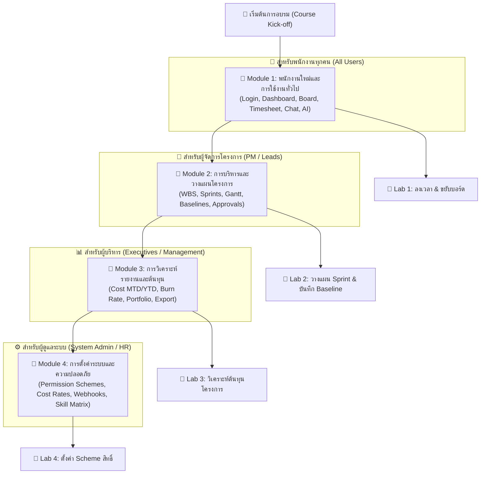

# 🎓 NexTime — Trainer & End-User Training Manual (คู่มือการอบรมและฝึกปฏิบัติระบบ)

> **เอกสารสำหรับ:** วิทยากรฝึกอบรม (Trainers), ผู้จัดการโครงการ (PM), หัวหน้างาน (Team Lead), พนักงานผู้ใช้งานทั่วไป (Employees), และผู้บริหาร (Executives)  
> **ระบบ:** NexTime Enterprise (Project Management & Timesheet System)  
> **วัตถุประสงค์:** ใช้เป็นคู่มือหลักในการจัดหลักสูตรฝึกอบรม (Courseware), การทำ Workshop ภาคปฏิบัติ, และเป็นเอกสารอ้างอิงการใช้งานรายบุคคล  

---

## 🧭 แผนผังหลักสูตรการอบรม (Training Curriculum Overview)



---

## ⏱️ ตารางเวลาการฝึกอบรม (Training Schedule & Agenda)

| ช่วงเวลา | หัวข้อการเรียนรู้ (Module) | กลุ่มเป้าหมาย | กิจกรรม / รูปแบบการอบรม |
|---|---|---|---|
| **09:00 - 10:30** | **Module 1:** พนักงานใหม่และการใช้งานประจำวัน | พนักงานทุกคน, SA, Dev, QA, PM | บรรยาย + สาธิต + **Lab 1 (บันทึกเวลางาน)** |
| **10:30 - 10:45** | ☕ พักเบรกเช้า (Morning Break) | - | - |
| **10:45 - 12:00** | **Module 2:** การวางแผนโครงการและบริหารจัดการสำหรับ PM | PM, Team Lead, SA | บรรยาย + สาธิต + **Lab 2 (วางแผน & Baseline)** |
| **12:00 - 13:00** | 🍱 พักรับประทานอาหารกลางวัน (Lunch) | - | - |
| **13:00 - 14:30** | **Module 3:** รายงานเชิงลึกและการควบคุมงบประมาณ | ผู้บริหาร, ผู้จัดการฝ่าย, PM | บรรยาย + สาธิต + **Lab 3 (รายงานต้นทุน)** |
| **14:30 - 14:45** | ☕ พักเบรกบ่าย (Afternoon Break) | - | - |
| **14:45 - 16:15** | **Module 4:** การตั้งค่าระบบขั้นสูงและการจัดการสิทธิ์ | Admin, HR, PMO | บรรยาย + สาธิต + **Lab 4 (Permission & Config)** |
| **16:15 - 16:45** | 🎯 สรุปผลการอบรม, ถาม-ตอบ (Q&A) และทดสอบประเมินผล | ผู้เข้าอบรมทุกคน | Quiz & Post-training Evaluation |

---

## 📘 MODULE 1: การใช้งานสำหรับพนักงานทั่วไป (Employee & General Users)

### วัตถุประสงค์การเรียนรู้ (Learning Objectives)
1. สามารถเข้าสู่ระบบด้วย Email/Password และ LINE Login ได้อย่างถูกต้อง
2. สามารถตรวจสอบงานที่ค้างส่งและงานใกล้ถึงกำหนดผ่านหน้า Dashboard และ Notification Bell ได้
3. สามารถอัปเดตสถานะงานบน Agile Kanban Board ได้อย่างถูกต้อง
4. สามารถบันทึกเวลาทำงาน (Timesheet), ระบุการทำงาน WFH, แนบหลักฐาน และส่งขออนุมัติได้
5. สามารถสื่อสารในแชทโครงการและใช้งาน AI Assistant เพื่อสอบถามข้อมูลได้

---

### 1.1 การลงชื่อเข้าใช้งาน (Login & Authentication)

```
[ขั้นตอนที่ 1] เข้า URL ระบบ -> [ขั้นตอนที่ 2] เลือกวิธี Login -> [ขั้นตอนที่ 3] เข้าสู่ Dashboard
```

1. **เข้าสู่ระบบด้วยอีเมลบริษัท:**
   - กรอก **Email** บริษัท เช่น `somchai@company.com`
   - กรอก **Password** (รหัสผ่านเริ่มต้นที่ได้รับจากผู้ดูแลระบบ)
   - กดปุ่ม **Sign In**
2. **เข้าสู่ระบบด้วย LINE Login:**
   - กดปุ่ม **"Sign in with LINE"**
   - สแกน QR Code หรือกรอก Email/Password ของ LINE
   - *หมายเหตุสำหรับวิทยากร:* ระบบจะทำการผูกบัญชีอัตโนมัติ (Auto-binding) หากอีเมลของ LINE ตรงกับอีเมลในฐานข้อมูลบริษัท

---

### 1.2 การทำความเข้าใจหน้า Dashboard และการแจ้งเตือน (Notifications)


1. **แถบสรุปงานของฉัน (My Tasks Widget):**
   - **Overdue (สีแดง):** งานที่เลยกำหนดส่งแล้วแต่ยังไม่เสร็จ $\rightarrow$ ต้องเร่งดำเนินการด่วน
   - **Due in 3 Days (สีส้ม):** งานที่ต้องส่งมอบภายใน 3 วันข้างหน้า
   - **Due This Week (สีฟ้า):** งานที่มีกำหนดส่งภายในสัปดาห์นี้
2. **ระฆังแจ้งเตือน (Notification Bell - มุมขวาบน):**
   - มีตัวเลขนับจำนวนแจ้งเตือนสีแดง
   - แสดงทั้งงานใกล้ถึงกำหนด, แจ้งเตือนเมื่อถูกแท็ก `@mention` ในแชท และแจ้งเตือนผลการอนุมัติใบลงเวลา

---

### 1.3 การจัดการงานบน Agile Kanban Board

1. ไปที่เมนู **Projects** $\rightarrow$ เลือกโครงการที่สังกัด $\rightarrow$ เข้าแท็บ **Board**
2. **การย้ายสถานะงาน (Task Transition):**
   - ลากการ์ดงาน (Drag & Drop) จากคอลัมน์ `To Do` $\rightarrow$ `In Progress` เมื่อเริ่มทำงาน
   - ลากไปยัง `Review` เมื่อพัฒนาเสร็จและรอการตรวจ
   - ลากไปยัง `Done` เมื่องานผ่านการตรวจสอบสมบูรณ์
3. **การดูรายละเอียดงานและการเพิ่ม Subtask:**
   - คลิกที่การ์ดงานเพื่อเปิด **Task Detail Modal**
   - สามารถพิมพ์คอมเมนต์, ดูประวัติ Git Commits, และเพิ่ม Subtask ย่อยได้

---

### 1.4 การบันทึกเวลาทำงานรายวัน (Timesheet Logging)

```
[เมนู Timesheet] -> [กดปุ่ม "+ Log Time"] -> [เลือกโครงการ & งาน] -> [ระบุชั่วโมง] -> [กด Save]
```

1. ไปที่เมนู **Timesheet** บนแถบข้าง
2. กดปุ่ม **"+ Log Time"**
3. กรอกข้อมูลในแบบฟอร์ม:
   - **Project:** เลือกโครงการที่ทำงาน
   - **Task:** เลือกงานที่ได้รับมอบหมาย
   - **Date:** เลือกวันที่ทำงาน
   - **Hours:** ระบุจำนวนชั่วโมงที่ใช้จริง (เช่น 8 ชั่วโมง หรือ 4.5 ชั่วโมง)
   - **Work From Home (WFH):** ติ๊กถูกหากวันดังกล่าวปฏิบัติงานนอกสถานที่
   - **Description / Work Results:** ระบุรายละเอียดสิ่งที่ได้ทำเสร็จในวันนั้น
   - **Attachment:** แนบภาพถ่ายหน้าจอหรือหลักฐานผลงาน (ถ้ามี)
4. กด **"Save Entry"** $\rightarrow$ รายการจะอยู่ในสถานะ **Pending (รออนุมัติ)** หรือ **Draft**
5. **การแก้ไข/ลบรายการ:** พนักงานสามารถแก้ไขหรือลบรายการของตนเองได้ตราบใดที่สถานะยังเป็น Draft หรือ Pending

---

### 1.5 การสื่อสารในแชทโครงการและการใช้ AI Assistant

1. **Project Chat:**
   - ไปที่เมนู **Team Chat** หรือคลิกไอคอนแชทในการ์ดโปรเจกต์
   - พิมพ์ `@` ตามด้วยชื่อเพื่อนร่วมทีมเพื่อส่งการแจ้งเตือนโดยตรง เช่น `@Jane Smith รบกวนตรวจ PR ให้หน่อยครับ`
2. **AI Chatbot Assistant:**
   - คลิกไอคอนแชทสีฟ้าที่มุมขวาล่างของจอ
   - พิมพ์คำถามเกี่ยวกับระบบ เช่น *"วิธีลงเวลา WFH ทำอย่างไร?", "สิทธิ์การลบงานใครทำได้บ้าง?"* AI จะตอบคำแนะนำทันที

---

## 📙 MODULE 2: การบริหารและวางแผนโครงการสำหรับ PM (Project Managers & Leads)

### วัตถุประสงค์การเรียนรู้ (Learning Objectives)
1. สามารถสร้างโครงการใหม่ กำหนดงบประมาณ และจัดสรรสมาชิกทีมพร้อมระบุ Project Role ได้
2. สามารถวางโครงสร้างงานแบบ WBS (Main Task & Subtasks) และควบคุมงบประมาณชั่วโมงได้
3. สามารถจัดทำแผนงานด้วย Gantt Chart และบันทึกเวอร์ชันแผนงาน (Project Baseline) ได้
4. สามารถวิเคราะห์ความคลาดเคลื่อนของแผนงาน (Schedule Slippage & Estimate Drift) ได้
5. สามารถตรวจสอบและอนุมัติใบลงเวลา (Timesheet Approvals) ของทีมงานได้อย่างรวดเร็ว

---

### 2.1 การสร้างและตั้งค่าโครงการ (Project Setup & Team Allocation)

1. ไปที่เมนู **Projects** $\rightarrow$ กดปุ่ม **"+ New Project"**
2. กำหนดรายละเอียดสำคัญ:
   - **Project Name & Description:** ชื่อและเป้าหมายโครงการ
   - **Project Type:** เลือกระหว่าง `Development Project` (สำหรับงานพัฒนาซอฟต์แวร์ที่มี Gantt/Baseline) หรือ `Support Project` (สำหรับงาน Helpdesk/Maintenance ที่เน้น Kanban)
   - **Start Date & End Date:** วันเริ่มต้นและกำหนดสิ้นสุดโครงการ
   - **Budget:** งบประมาณรวมของโครงการ (บาท)
   - **Team Members & Project Roles:** เพิ่มพนักงานเข้าร่วมโครงการพร้อมกำหนดตำแหน่งเฉพาะ เช่น:
     - `PM` (Project Manager)
     - `Tech Lead` / `Architecture`
     - `Frontend Developer` / `Backend Developer`
     - `Quality Assurance (QA)`
     - `Application Support`

---

### 2.2 การแบ่งงานแบบ WBS และควบคุมงบประมาณชั่วโมง (Task Hierarchy)

```
┌────────────────────────────────────────────────────────┐
│ Main Task: "พัฒนาระบบชำระเงินออนไลน์" [Budget: 40 ชม.]    │
├────────────────────────────────────────────────────────┤
│  ├── Subtask 1: "ออกแบบ Database Schema" [8 ชม.]       │
│  ├── Subtask 2: "พัฒนา API เชื่อมต่อ Payment Gateway" [20 ชม.] │
│  └── Subtask 3: "ทดสอบ Unit Test & Security" [12 ชม.]   │
└────────────────────────────────────────────────────────┘
```

1. **การสร้าง Main Task:** สร้างงานหลักที่เป็น Milestone กำหนดจำนวนชั่วโมงประมาณการรวม (`estimated_hours`)
2. **การแตก Subtask:** คลิกที่งานหลัก $\rightarrow$ กด **"Add Subtask"** เพื่อแบ่งงานย่อย
3. **กฎสำคัญที่ PM ต้องรู้:**
   - ผลรวมชั่วโมงของงานย่อยทั้งหมด **ต้องไม่เกิน** ชั่วโมงงบประมาณของงานหลัก
   - เปอร์เซ็นต์ความคืบหน้าของงานหลักจะคำนวณจากสัดส่วนของงานย่อยที่เสร็จ (`Done`) อัตโนมัติ

---

### 2.3 การวางแผนด้วย Gantt Chart และการบันทึก Project Baseline

1. ไปที่เมนู **Project Plan** $\rightarrow$ เลือกโครงการ
2. **การปรับแต่ง Timeline:** ปรับลากแท่ง Gantt Bar เพื่อกำหนดวันเริ่มต้นและวันสิ้นสุดของแต่ละงาน
3. **การบันทึก Baseline Snapshot (แผนอ้างอิงฐานข้อมูล):**
   - เมื่อประชุมตกลงแผนงานร่วมกับลูกค้าหรือผู้บริหารเรียบร้อย ให้กดปุ่ม **"📸 Create Baseline"**
   - ตั้งชื่อ Baseline เช่น `Initial Plan Baseline v1.0`
   - ระบบจะบันทึก Snapshot ของทุก Task ในขณะนั้นเก็บไว้ในฐานข้อมูล
4. **การเปิดใช้งาน Active Plan:**
   - เลือก Baseline ที่ต้องการแล้วกด **"Set as Active Plan"**
   - ระบบจะใช้ Baseline นี้เป็นเกณฑ์มาตรฐานในการเปรียบเทียบความล่าช้า

---

### 2.4 การวิเคราะห์ความคลาดเคลื่อนของแผนงาน (Drift & Slippage Analysis)

เมื่อทีมงานปฏิบัติงานจริงและมีการเลื่อนกำหนดส่งงาน ระบบ NexTime จะคำนวณความคลาดเคลื่อนให้อัตโนมัติ:


- **Schedule Slippage (วันล่าช้าสะสม):** แสดงจำนวนวันที่แผนงานจริงล่าช้ากว่า Baseline ดั้งเดิม (ไฮไลต์สีแดงหากล่าช้าเกิน 7 วัน)
- **Estimate Drift (ชั่วโมงคลาดเคลื่อน):** แสดงผลต่างของชั่วโมงทำงานที่ต้องใช้เพิ่มขึ้นจากเดิม
- **Story Points Drift:** ความยากของงานที่เพิ่มขึ้นจาก Requirement ที่เปลี่ยนไป

---

### 2.5 การตรวจสอบและอนุมัติใบลงเวลา (Timesheet Approvals)

```
[เมนู Team / Approvals] -> [กรองสถานะ Pending] -> [ตรวจชั่วโมง & ผลงาน] -> [กด Approve / Reject]
```

1. ไปที่เมนู **Team** $\rightarrow$ เข้าสู่แท็บ **Timesheet Approvals**
2. ตัวกรองการตรวจสอบ:
   - กรองตามโครงการ, วันที่, หรือพนักงานรายบุคคล
   - ดูสถิติรวมชั่วโมงที่ขออนุมัติ
3. **การพิจารณา:**
   - ตรวจสอบจำนวนชั่วโมง, งานที่อ้างอิง, และผลงาน (`Work Results`) หรือภาพแนบ
   - กดปุ่ม **"Approve"** (สีเขียว) เพื่ออนุมัติ $\rightarrow$ ข้อมูลจะถูกล็อกและนำไปคำนวณต้นทุนทันที
   - กดปุ่ม **"Reject"** (สีแดง) หากข้อมูลไม่ถูกต้อง พนักงานจะได้รับแจ้งเตือนเพื่อกลับไปแก้ไข

---

## 📕 MODULE 3: รายงานเชิงลึกและการควบคุมงบประมาณสำหรับผู้บริหาร (Executive & Management)

### วัตถุประสงค์การเรียนรู้ (Learning Objectives)
1. สามารถอ่านแดชบอร์ดสรุปต้นทุนโครงการ (Project Cost Summary) ได้
2. สามารถวิเคราะห์ความคุ้มค่าและอัตราการใช้งบประมาณ (Budget Burn Rate) ได้
3. สามารถตรวจสอบแนวโน้มการทำงานของทีมงาน (Resource Trends) ได้
4. สามารถเปรียบเทียบพอร์ตโฟลิโอหลายโครงการ (PM Portfolio) และส่งออกข้อมูลเป็น CSV/PDF ได้

---

### 3.1 การอ่านรายงานต้นทุนโครงการ (Project Cost Analysis)

ไปที่เมนู **Reports** $\rightarrow$ เข้าแท็บ **Cost Summary**:

$$\text{Project Actual Cost} = \sum (\text{Approved Hours} \times \text{Labor Hourly Rate})$$

1. **ตัวชี้วัดสำคัญ (Key Financial Metrics):**
   - **Total Budget:** งบประมาณที่ได้รับอนุมัติทั้งหมด
   - **Actual Cost (Total):** ต้นทุนค่าแรงที่เกิดขึ้นจริงสะสมทั้งหมด
   - **MTD Cost (Month-to-Date):** ต้นทุนค่าแรงที่เกิดขึ้นเฉพาะในเดือนปัจจุบัน
   - **YTD Cost (Year-to-Date):** ต้นทุนค่าแรงที่เกิดขึ้นในปีปัจจุบัน
   - **Remaining Budget:** งบประมาณคงเหลือ
2. **กราฟ Budget vs Actual Spending:** แสดงแถบเปรียบเทียบงบประมาณที่ใช้ไปกับเพดานงบประมาณ

---

### 3.2 กราฟแนวโน้มการใช้ทรัพยากร (Resource Trends Graph)

1. เข้าแท็บ **Resource Trends** ในหน้า Reports
2. เลือกระยะเวลาการแสดงผล: **Daily**, **Monthly**, หรือ **Yearly**
3. กราฟจะพล็อตเส้นจำนวนชั่วโมงทำงานของสมาชิกแต่ละคน ทำให้เห็นภาพชัดเจนว่าใครมี Workload เกินพิกัด (Overloaded) หรือใครยังมี Capacity ว่าง

---

### 3.3 การวิเคราะห์ภาพรวมหลายโครงการ (Portfolio View) และการ Export ข้อมูล

1. เข้าแท็บ **PM Portfolio** เพื่อดูสรุปสุขภาพของทุกโครงการในองค์กรในหน้าเดียว
2. **การส่งออกรายงาน (Export):**
   - กดปุ่ม **"Export CSV"** เพื่อนำข้อมูลดิบไปวิเคราะห์ต่อใน Microsoft Excel
   - กดปุ่ม **"Print / Export PDF"** เพื่อพิมพ์รายงานสรุปผลงานนำเสนอในที่ประชุมผู้บริหาร

---

## 📗 MODULE 4: การตั้งค่าระบบและการจัดการสิทธิ์สำหรับ Admin (System Admin & HR)

### วัตถุประสงค์การเรียนรู้ (Learning Objectives)
1. สามารถปรับแต่ง Permission Schemes และกำหนดสิทธิ์ 9 มิติได้อย่างปลอดภัย
2. สามารถกำหนดและปรับปรุงอัตราค่าจ้างตามตำแหน่ง (Cost Rates & Labor Rates) ได้
3. สามารถสร้างแม่แบบงานมาตรฐาน (Milestone Templates) ได้
4. สามารถเชื่อมต่อ Git Webhooks สำหรับการทำงานแบบ DevOps อัตโนมัติได้
5. สามารถจัดการฐานข้อมูลช่างและ Skill Matrix ได้

---

### 4.1 การจัดการ Permission Schemes

1. ไปที่เมนู **Settings** $\rightarrow$ เลื่อนลงมาที่ส่วน **Permission Schemes**
2. กดปุ่ม **"+ Create New Scheme"**
3. ติ๊กเลือกสิทธิ์ในแต่ละฟังก์ชัน (9 รายการ) ให้กับแต่ละบทบาท:
   - `Browse Project`, `Create Task`, `Edit Task`, `Assign Task`, `Delete Task`, `Transition Task`, `Manage Sprints`, `Manage Releases`, `Manage Members`
4. บันทึกและนำ Scheme ไปผูกเข้ากับโครงการที่ต้องการในการ์ด Project Settings

---

### 4.2 การตั้งค่าอัตราค่าแรง (Cost Rates & Labor Rates)

1. ไปที่เมนู **Settings** $\rightarrow$ เลื่อนลงมาที่ส่วน **Cost & Labor Rates**
2. ระบบจะแสดงตารางอัตราค่าแรงต่อวันและต่อชั่วโมงของแต่ละตำแหน่ง เช่น:
   - *Business Solution Analyst:* 6,500 บาท/วัน (812.50 บาท/ชั่วโมง)
   - *Tech Lead / Architecture:* 6,500 บาท/วัน (812.50 บาท/ชั่วโมง)
   - *Senior Backend Developer:* 6,500 บาท/วัน (812.50 บาท/ชั่วโมง)
3. Admin สามารถกดแก้ไขตัวเลขอัตราค่าจ้าง หรือกด **"+ Add Role Rate"** เพื่อเพิ่มตำแหน่งใหม่ได้

---

### 4.3 การจัดการแม่แบบงานมาตรฐาน (Milestone Templates)

1. ไปที่ส่วน **Milestone Templates** ในหน้า Settings
2. กำหนดขั้นตอนงานมาตรฐานขององค์กร เช่น *Kickoff Meeting (0-2%), UI/UX Design (20-35%), Development (40-75%), UAT (85-95%)*
3. เมื่อสร้างโครงการใหม่ PM สามารถกดโหลดแม่แบบเหล่านี้เข้ามาเป็นโครงสร้างงานเริ่มต้นได้ทันทีในคลิกเดียว

---

### 4.4 การจัดการข้อมูลช่าง & Skill Matrix (Technician Matrix)

1. ไปที่เมนู **ข้อมูลช่าง & Skill Matrix**
2. ดูและบริหารจัดการช่างตามระดับ Tier: **Gold**, **Silver**, **Bronze**, และ **Cooldown**
3. บันทึกระดับทักษะ (Skill Levels 1-3), ความเชี่ยวชาญเฉพาะทาง (เช่น Built-in, Smart Home, Plumbing) และเอกสารใบรับรอง (Certified)
4. ติดตามคะแนน Rating, งานที่เสร็จสะสม, และประวัติการตัดคะแนน (Penalty Points)

---

## 🧪 WORKSHOP & HANDS-ON LABS (แบบฝึกหัดภาคปฏิบัติ)

### 🧪 LAB 1: สำหรับพนักงาน (Time Logging & Board Movement)
- **โจทย์:** 
  1. ล็อกอินเข้าสู่ระบบด้วยชื่อตนเอง
  2. ไปที่โครงการ `NexTime Internal Tool` $\rightarrow$ หาการ์ดงานของตนเองในคอลัมน์ `To Do` แล้วลากไปยัง `In Progress`
  3. ไปที่เมนู **Timesheet** บันทึกการลงเวลา 8 ชั่วโมง สำหรับงานดังกล่าว ระบุรายละเอียดผลงานและติ๊ก WFH
  4. กลับไปที่หน้า **Dashboard** ตรวจสอบว่าจำนวนชั่วโมงสะสมในสัปดาห์นี้อัปเดตถูกต้องหรือไม่
- **เกณฑ์การผ่าน:** รายการ Timesheet ขึ้นสถานะ `Pending` และการ์ดงานอยู่คอลัมน์ `In Progress`

---

### 🧪 LAB 2: สำหรับ PM (Project Planning & Baseline Snapshot)
- **โจทย์:**
  1. สร้างโครงการใหม่ชื่อ `Workshop CRM Project` กำหนดงบประมาณ 200,000 บาท
  2. เพิ่มสมาชิกทีม 2 คน และสร้าง Main Task 1 งาน พร้อม Subtask 2 งาน (ชั่วโมงรวมไม่เกิน 24 ชม.)
  3. ไปที่ **Project Plan (Gantt Chart)** กำหนด Timeline ของงาน
  4. บันทึก Baseline ในชื่อ `Baseline v1 - Kickoff` และตั้งค่าเป็น Active Plan
  5. ทดลองขยับวันส่งงานของ Subtask ให้ช้าลง 3 วัน แล้วสังเกตค่า Schedule Drift ที่ระบบคำนวณ
- **เกณฑ์การผ่าน:** แสดง Schedule Slippage สีส้ม +3 วัน และ Progress คำนวณตาม Subtask ถูกต้อง

---

### 🧪 LAB 3: สำหรับผู้บริหารและ PM (Timesheet Approval & Cost Audit)
- **โจทย์:**
  1. ไปที่เมนู **Team** $\rightarrow$ เข้าแท็บ **Timesheet Approvals**
  2. ตรวจสอบรายการลงเวลาของเพื่อนร่วมชั้นเรียนจาก Lab 1 แล้วกด **"Approve"**
  3. ไปที่เมนู **Reports** $\rightarrow$ ตรวจสอบว่า MTD Cost และ Project Actual Cost ของโครงการเพิ่มขึ้นตามอัตราค่าแรงของพนักงานคนนั้นหรือไม่
- **เกณฑ์การผ่าน:** สถานะใบลงเวลาเปลี่ยนเป็น `Approved` (ล็อกการแก้ไข) และต้นทุนโครงการแสดงผลถูกต้อง

---

## ❓ คำถามที่พบบ่อยสำหรับวิทยากร (Trainer FAQ & Tips)

1. **Q: หากพนักงานลงเวลาผิดหลังจาก PM กด Approve ไปแล้ว จะแก้ไขอย่างไร?**
   - *คำแนะนำสำหรับวิทยากร:* แจ้งผู้เรียนว่าผู้ใช้บทบาท **Admin** หรือ **Manager** สามารถไปที่หน้า Timesheet แล้วกดไอคอนถังขยะลบรายการ Approved นั้นทิ้งได้ เพื่อให้พนักงานกดบันทึกใหม่ที่ถูกต้องเข้ามา
2. **Q: ทำไมโครงการประเภท Support ถึงไม่แสดง Gantt Chart หรือ Baseline?**
   - *คำแนะนำสำหรับวิทยากร:* ชี้แจงว่าโครงการ Support เป็นงานประเภท Ticket/Maintenance ที่ไม่มีกำหนดวันสิ้นสุดแน่นอน (Ongoing) ระบบจึงออกแบบให้ข้ามการคำนวณ Baseline เพื่อลดความซับซ้อนและให้ทีมโฟกัสที่ Kanban Board และการลงเวลาเป็นหลัก
3. **Q: แท็กเพื่อนในแชทแล้วเพื่อนไม่เห็นแจ้งเตือน เกิดจากอะไร?**
   - *คำแนะนำสำหรับวิทยากร:* ให้ตรวจสอบว่าพิมพ์ `@` แล้วเลือกชื่อจาก Dropdown ถูกต้องหรือไม่ และเพื่อนคนนั้นเปิดดูหน้าจอระบบอยู่หรือไม่ (ระบบจะ Polling แจ้งเตือนทุกๆ 5 วินาที)

---
*เอกสารหลักสูตรการฝึกอบรมระบบ NexTime จัดทำโดยทีมวิทยากรและ System Analyst พ.ศ. 2569*
