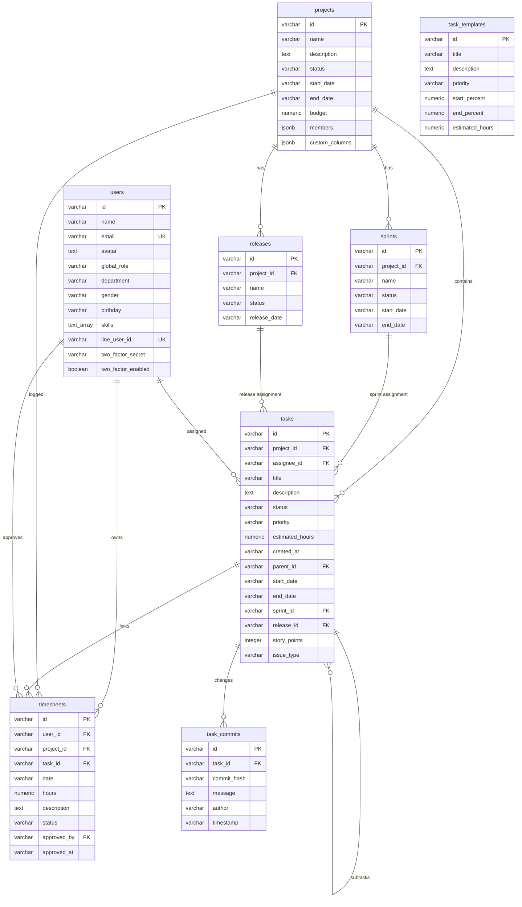

# System Architecture & Database Schema Report
**ระบบ NexTime — Timesheet & Project Management System**
**ผู้วิเคราะห์:** agent_sa (Systems Analyst)  
**วันที่รายงาน:** 16 มิถุนายน 2026

---

## 📋 1. บทสรุปสำหรับผู้บริหาร (Executive Summary)
ระบบ **NexTime** คือเว็บแอปพลิเคชันเพื่อการจัดการทรัพยากรบุคคลและโครงการภายในองค์กร โดยเน้นที่การบันทึกชั่วโมงทำงาน (Timesheet Log), แผนงานโครงการแบบแกนต์ชาร์ต (Project Plan & Gantt Chart), และบอร์ดงาน Kanban (Kanban Board) 

ระบบถูกออกแบบมาให้มีความมั่นคงปลอดภัยสูงผ่านการยืนยันตัวตนด้วย **LINE Login** ร่วมกับการตรวจสอบสิทธิ์แบบสองปัจจัย (**2-Factor Authentication - OTP** ผ่านอีเมลบริษัท) พร้อมความสามารถในการส่งอีเมลแจ้งเตือนอัตโนมัติแบบ **Asynchronous (Non-blocking)** และระบบ **Git Integration** เพื่ออัปเดตสถานะงานผ่าน Webhook อัตโนมัติ

---

## 📁 2. โครงสร้างโฟลเดอร์ของโปรเจกต์ (Project Folder Structure)

โครงสร้างโฟลเดอร์ของโปรเจกต์ได้รับการจัดระเบียบตามรูปแบบ Monorepo (NodeJS Express Backend + Vite React Frontend อยู่ร่วมกัน) ดังนี้:

```text
c:\atgv\time_sheet\
├── src/                    # โครงสร้างส่วน Frontend (Vite + React + TS)
│   ├── assets/             # รูปภาพประกอบและไอคอนระบบ (เช่น hero.png, vite.svg)
│   ├── components/         # คอมโพเนนต์หน้าจอหลัก (React Components)
│   │   ├── Dashboard.tsx   # แสดงสรุปชั่วโมงทำงานและกิจกรรมล่าสุด (Dark Mode/Glassmorphism)
│   │   ├── Login.tsx       # หน้าล็อกอินเชื่อมต่อ LINE Login & OTP 2FA
│   │   ├── ProjectPlan.tsx # แสดง Gantt Chart ไทม์ไลน์ และระบบ Auto Milestone Generator
│   │   ├── Projects.tsx    # จัดการรายชื่อโครงการ งบประมาณ และสมาชิกทีม
│   │   ├── Reports.tsx     # กราฟรายงานชั่วโมงทำงานแยกตามบุคคล/โครงการ/งาน
│   │   ├── Settings.tsx    # ตั้งค่าระบบและจัดการเทมเพลตแผนงานเริ่มต้น (Admin Task Templates)
│   │   ├── Tasks.tsx       # Kanban Board รองรับ Drag & Drop (dnd-kit) และ Priority Color Code
│   │   ├── TeamApprovals.tsx # ตรวจสอบบันทึกเวลาของสมาชิกเพื่ออนุมัติ/ปฏิเสธ พร้อมฐานข้อมูลพนักงาน
│   │   └── Timesheet.tsx   # บันทึกเวลางานระบุตามโครงการ/งานย่อย พร้อมสถานะ Draft, Pending, Approved
│   ├── data/
│   │   └── mockData.ts     # ข้อมูลทดสอบระบบ (ใช้ทดแทนเมื่อเชื่อมต่อฐานข้อมูลหลักไม่ได้)
│   ├── types/
│   │   └── index.ts        # นิยามโครงสร้างข้อมูล (TypeScript Type Definitions)
│   ├── App.css             # สไตล์หลักของ React
│   ├── App.tsx             # รูทคอมโพเนนต์ จัดการ State และ Routing (React Router v7)
│   ├── index.css           # จัดการ CSS ทั่วทั้งระบบ
│   └── main.tsx            # จุดเริ่มต้นการโหลดโปรแกรมของฝั่งไคลเอนต์
├── dist/                   # โฟลเดอร์ที่เก็บไฟล์ Frontend ที่ Build สำเร็จสำหรับโปรดักชัน
├── node_modules/           # โฟลเดอร์เก็บไลบรารีและโมดูลของ NodeJS
├── scratch/                # สคริปต์สคราตช์สำหรับงานชั่วคราว/ทดสอบ
│   ├── test_db.js          # สคริปต์ทดสอบการเชื่อมต่อฐานข้อมูลบน VPS
│   ├── test_email.js       # สคริปต์ทดสอบการส่งอีเมลผ่าน SMTP
│   └── sa_system_report.md # เอกสารรายงานฉบับนี้
├── public/                 # เก็บไฟล์ Static Asset ทั่วไป
├── .env                    # ไฟล์เก็บตัวแปรระบบและคีย์ความปลอดภัย (LINE, SMTP, PostgreSQL Connection)
├── .gitignore              # ไฟล์กำหนดการละเว้นไฟล์ไม่ให้เก็บเข้า Git (เช่น .env, node_modules)
├── db_schema.sql           # ไฟล์คำสั่ง SQL สำหรับเตรียมโครงสร้างตารางเริ่มต้น
├── eslint.config.js        # กำหนดคอนฟิกของ ESLint เพื่อตรวจสอบมาตรฐานโค้ด
├── index.html              # หน้าเว็บหลัก (Entry HTML) ของ SPA
├── mailService.js          # บริการสร้างและส่งอีเมลแจ้งเตือนผ่าน SMTP (Nodemailer)
├── nixpacks.toml           # การกำหนดค่าสำหรับการจัดทำคอนเทนเนอร์และ Deploy ผ่าน Coolify
├── package.json            # ไฟล์ระบุสคริปต์Dependenciesและข้อมูลโปรเจกต์
├── server.js               # Express Backend Server หลัก จัดการ REST APIs, Webhooks และฐานข้อมูล
├── system_setup.md         # คู่มือคู่มือสรุปวิธีติดตั้งและรันระบบ
├── timesheet_systemguide.md# คู่มืออธิบายฟังก์ชันการทำงานหลักของระบบ
├── tsconfig.json           # การตั้งค่าทรานส์ไพล์เลอร์ของ TypeScript
└── user_manual.md          # คู่มือการใช้งานระบบสำหรับผู้ใช้ทั่วไปและผู้ดูแลระบบ
```

---

## 🌐 3. สถาปัตยกรรมระบบ (System Architecture)

ระบบประกอบด้วยองค์ประกอบ 3 ส่วนหลัก (3-Tier Architecture):

```
+--------------------------------------------------------+
|                      Client Layer                      |
|  [Vite + React 19 SPA]                                  |
|  - UI/UX Components (Kanban, Timesheet, Dashboard)     |
|  - Local Storage Persistence & Webcam Capture          |
+---------------------------+----------------------------+
                            | (REST APIs / JSON)
                            v
+--------------------------------------------------------+
|                      Server Layer                      |
|  [Express 5 (Node.js) on Coolify]                      |
|  - Authentication Service (LINE Login & JWT & OTP)     |
|  - Email Notification Agent (Nodemailer Asynchronous)   |
|  - Git Webhooks Receiver (GitHub/GitLab Integrations)  |
+---------------------------+----------------------------+
                            | (PostgreSQL Protocol)
                            v
+--------------------------------------------------------+
|                     Database Layer                     |
|  [PostgreSQL Server on Hostinger VPS]                  |
|  - 8 Relational Tables                                 |
|  - Remote Connection Secured via Firewall (UFW)       |
+--------------------------------------------------------+
```

### 3.1 การเชื่อมต่อและสิทธิ์เข้าถึงฐานข้อมูล (Database Connectivity)
* **ที่อยู่โฮสต์ (Host IP):** `187.77.147.16` (พอร์ต `5432`)
* **ชื่อฐานข้อมูล (Database):** `timesheet_db`
* **ผู้ใช้งาน (User):** `isara_admin`
* **การรักษาความปลอดภัยระดับเครือข่าย:** 
  1. การเชื่อมต่อระยะไกลเปิดให้เข้าถึงได้เฉพาะผู้ใช้ที่ผ่านระบบล็อกอินความปลอดภัยผ่านไฟล์ `pg_hba.conf`
  2. เปิดพอร์ต `5432` บนไฟร์วอลล์ `UFW` ของ Hostinger VPS

### 3.2 ขั้นตอนการตรวจสอบสิทธิ์และการทำงานร่วมกับ LINE (LINE Login & 2FA OTP)
```
[User] --(1. Click LINE Login)--> [LINE Auth Server] --(2. Redirect with Code)--> [Express Server]
                                                                                          |
[User] <--(4. OTP Email Sent)-------(3. Generate OTP & Check User Email)-----------------+
  |
  +--(5. Submit OTP)------------> [Express Server] --(6. Verify & Issue JWT)--> [Frontend Portal]
```
1. **การลงทะเบียนล่วงหน้า:** ผู้ดูแลระบบเพิ่มข้อมูลพนักงานลงฐานข้อมูลด้วยอีเมลบริษัท
2. **การเข้าสู่ระบบ:** พนักงานสแกน QR Code/กดปุ่มเชื่อมระบบ LINE Login ระบบดึงข้อมูล UUID (`line_user_id`) และอีเมลจาก LINE profile
3. **การส่งรหัส 2FA:** หากเป็นการล็อกอินครั้งแรก ระบบจะทำการจับคู่อีเมล และทำการส่งรหัส OTP 6 หลักไปยังอีเมลบริษัทของพนักงาน
4. **การยืนยันและเปิดสิทธิ์:** พนักงานกรอก OTP บนเว็บระบบจะเชื่อม LINE ID ถาวรและออกสิทธิ์เป็น Access Token (JWT) ทำให้การล็อกอินครั้งต่อๆ ไปผ่าน LINE สามารถทำได้โดยอัตโนมัติ

### 3.3 ระบบส่งอีเมลแจ้งเตือนอัตโนมัติ (Asynchronous Email Notification)
ใช้บริการ SMTP ของ Gmail ในลักษณะ Asynchronous Non-blocking เพื่อป้องกันปัญหาระบบหน่วง:
* **แจ้งเตือนการส่งเวลา (Employee -> PM):** เมื่อพนักงานส่งบันทึกเวลางานระบบจะส่งอีเมลแจ้งเตือนไปยัง PM ผู้ดูแลโครงการทันทีเพื่อขอการอนุมัติ
* **แจ้งเตือนผลการอนุมัติ (PM -> Employee):** เมื่อ PM กดอนุมัติหรือปฏิเสธเวลา ระบบจะส่งอีเมลแจ้งสถานะพร้อมเหตุผลกลับไปยังพนักงานต้นเรื่อง

### 3.4 การผสานการอัปเดตผ่าน Git (GitHub & GitLab Integration Webhooks)
ระบบรองรับ Webhook จาก GitHub และ GitLab เมื่อมี Developer คอมมิตงานเข้ามาที่ Repository:
1. ระบบ Express รับ Webhook Payload และสแกนเนื้อหา Commit Message ด้วย Regular Expression เพื่อค้นหารูปแบบ Ticket ID เช่น `[t1]` หรือ `#t_123`
2. อัปเดตตาราง `task_commits` บันทึก Hash, ข้อความคอมมิต, และชื่อผู้ส่งคอมมิต
3. ค้นหาคีย์เวิร์ดควบคุม เช่น `fix`, `resolve`, `complete`, `done`, `close` เพื่อเปลี่ยนสถานะการ์ดงานของตาราง `tasks` เป็นสถานะคอลัมน์สุดท้ายของบอร์ดโครงการ (เช่น `Done`) อัตโนมัติ หรือคำว่า `work`, `progress`, `develop` เพื่อเปลี่ยนเป็น `In Progress`

---

## 🗄️ 4. โครงสร้างตารางฐานข้อมูล (Database Schema Specifications)

ฐานข้อมูลประกอบด้วยตารางความสัมพันธ์เชิงสัมพันธ์ (Relational Database) ทั้งสิ้น 8 ตารางหลัก:

### 4.1 ตาราง `users` (ข้อมูลผู้ใช้งาน)
ใช้สำหรับบันทึกข้อมูลพนักงาน บทบาทในระบบ และความเชี่ยวชาญ

| ชื่อคอลัมน์ | ชนิดข้อมูล | คุณสมบัติพิเศษ | คำอธิบาย |
| :--- | :--- | :--- | :--- |
| `id` | `VARCHAR(50)` | `PRIMARY KEY` | รหัสพนักงาน (เช่น u1, u2) |
| `name` | `VARCHAR(100)` | `NOT NULL` | ชื่อ-นามสกุลพนักงาน |
| `email` | `VARCHAR(150)` | `NOT NULL UNIQUE` | อีเมลบริษัทที่ใช้ระบุตัวตนและส่ง OTP |
| `avatar` | `TEXT` | `NULL` | ลิงก์รูปโปรไฟล์พนักงาน หรือภาพเข้ารหัส Base64 จากกล้อง |
| `global_role` | `VARCHAR(50)` | `NOT NULL` | สิทธิ์ระดับระบบ: `Admin`, `Owner`, `Employee` |
| `department` | `VARCHAR(100)` | `NULL` | แผนกหรือฝ่ายที่สังกัด |
| `gender` | `VARCHAR(50)` | `NULL` | เพศของพนักงาน |
| `birthday` | `VARCHAR(50)` | `NULL` | วันเกิดของพนักงาน (เก็บรูปแบบ YYYY-MM-DD เพื่อรองรับ React Date Picker) |
| `skills` | `TEXT[]` | `DEFAULT '{}'` | ความเชี่ยวชาญพิเศษด้านเทคโนโลยี (เก็บเป็น Array) |
| `line_user_id` | `VARCHAR(100)` | `UNIQUE NULL` | รหัสประจำตัวจาก LINE Login (ใช้จับคู่ระบบล็อกอิน) |
| `two_factor_secret` | `VARCHAR(100)` | `NULL` | คีย์ลับสำหรับ OTP (ถ้าเปิดใช้งาน) |
| `two_factor_enabled`| `BOOLEAN` | `DEFAULT FALSE` | สถานะการเปิดระบบ 2FA |

### 4.2 ตาราง `projects` (ข้อมูลโครงการ)
เก็บบันทึกรายละเอียด ขอบเขตงาน และสมาชิกหลักประจำโครงการ

| ชื่อคอลัมน์ | ชนิดข้อมูล | คุณสมบัติพิเศษ | คำอธิบาย |
| :--- | :--- | :--- | :--- |
| `id` | `VARCHAR(50)` | `PRIMARY KEY` | รหัสโครงการ (เช่น p1, p2) |
| `name` | `VARCHAR(150)` | `NOT NULL` | ชื่อโครงการ |
| `description` | `TEXT` | `NULL` | คำอธิบายขอบเขตของโครงการ |
| `status` | `VARCHAR(50)` | `NOT NULL` | สถานะโครงการ (เช่น `Planning`, `Active`, `Completed`) |
| `start_date` | `VARCHAR(50)` | `NOT NULL` | วันเริ่มโครงการ (YYYY-MM-DD) |
| `end_date` | `VARCHAR(50)` | `NULL` | วันที่คาดว่าจะสิ้นสุดโครงการ |
| `budget` | `NUMERIC` | `NULL` | งบประมาณโครงการ |
| `members` | `JSONB` | `DEFAULT '[]'::jsonb` | รายชื่อและสิทธิ์สมาชิกโครงการ เช่น `[{"userId": "u1", "role": "PM"}]` |
| `custom_columns` | `JSONB` | `DEFAULT '["To Do", ...]'` | คอลัมน์สถานะบอร์ดงานเฉพาะโครงการนั้น ๆ |

### 4.3 ตาราง `sprints` (รอบพัฒนาแบบ Agile)
ใช้จัดระเบียบโครงการในรูปแบบ Agile Sprint

| ชื่อคอลัมน์ | ชนิดข้อมูล | คุณสมบัติพิเศษ | คำอธิบาย |
| :--- | :--- | :--- | :--- |
| `id` | `VARCHAR(50)` | `PRIMARY KEY` | รหัส Sprint |
| `project_id` | `VARCHAR(50)` | `NOT NULL REFERENCES projects(id) ON DELETE CASCADE` | โครงการที่เป็นเจ้าของ Sprint นี้ |
| `name` | `VARCHAR(150)` | `NOT NULL` | ชื่อ Sprint (เช่น Sprint 1) |
| `status` | `VARCHAR(50)` | `NOT NULL` | สถานะ Sprint (`Planned`, `Active`, `Completed`) |
| `start_date` | `VARCHAR(50)` | `NULL` | วันที่เริ่มต้น Sprint |
| `end_date` | `VARCHAR(50)` | `NULL` | วันที่สิ้นสุด Sprint |

### 4.4 ตาราง `releases` (การส่งมอบงาน/รุ่นของโครงการ)
ใช้แบ่งรุ่นการส่งมอบงาน

| ชื่อคอลัมน์ | ชนิดข้อมูล | คุณสมบัติพิเศษ | คำอธิบาย |
| :--- | :--- | :--- | :--- |
| `id` | `VARCHAR(50)` | `PRIMARY KEY` | รหัส Release |
| `project_id` | `VARCHAR(50)` | `NOT NULL REFERENCES projects(id) ON DELETE CASCADE` | โครงการที่เป็นเจ้าของ Release นี้ |
| `name` | `VARCHAR(150)` | `NOT NULL` | ชื่อรุ่น/เวอร์ชันส่งมอบ (เช่น v1.0.0) |
| `status` | `VARCHAR(50)` | `NOT NULL` | สถานะ (`Unreleased`, `Released`) |
| `release_date` | `VARCHAR(50)` | `NULL` | วันที่เปิดตัว/ส่งมอบงาน |

### 4.5 ตาราง `tasks` (รายการงานย่อย)
เก็บบันทึกรายละเอียดการ์ดงานของแต่ละโครงการ มีความสัมพันธ์กับสมาชิก, Sprints, และ Releases

| ชื่อคอลัมน์ | ชนิดข้อมูล | คุณสมบัติพิเศษ | คำอธิบาย |
| :--- | :--- | :--- | :--- |
| `id` | `VARCHAR(50)` | `PRIMARY KEY` | รหัสการ์ดงาน (เช่น t1) |
| `project_id` | `VARCHAR(50)` | `NOT NULL` | รหัสโครงการที่สังกัด |
| `assignee_id` | `VARCHAR(50)` | `NULL` | รหัสพนักงานที่ได้รับมอบหมาย |
| `title` | `VARCHAR(200)` | `NOT NULL` | ชื่องานย่อย |
| `description` | `TEXT` | `NULL` | รายละเอียดวิธีดำเนินงาน |
| `status` | `VARCHAR(50)` | `NOT NULL` | สถานะงาน (ต้องมีค่าตรงกับคอลัมน์ใน `custom_columns` ของโครงการ) |
| `priority` | `VARCHAR(50)` | `NOT NULL` | ความสำคัญ: `Low`, `Medium`, `High`, `Urgent` |
| `estimated_hours` | `NUMERIC` | `NOT NULL DEFAULT 0` | ชั่วโมงประเมินสำหรับการทำงานนี้ |
| `created_at` | `VARCHAR(50)` | `NOT NULL` | วันเวลาที่สร้างการ์ดงาน |
| `parent_id` | `VARCHAR(50)` | `NULL` | กรณีมีงานแม่/งานลูก (Parent-Subtask relationship) |
| `start_date` | `VARCHAR(50)` | `NULL` | วันเริ่มงานย่อย |
| `end_date` | `VARCHAR(50)` | `NULL` | วันสิ้นสุดงานย่อย |
| `sprint_id` | `VARCHAR(50)` | `REFERENCES sprints(id) ON DELETE SET NULL` | Sprint ที่เกี่ยวข้อง |
| `release_id` | `VARCHAR(50)` | `REFERENCES releases(id) ON DELETE SET NULL` | Release ที่เกี่ยวข้อง |
| `story_points` | `INTEGER` | `DEFAULT 0` | คะแนนความยากง่ายของงาน (Story Points) |
| `issue_type` | `VARCHAR(50)` | `DEFAULT 'Task'` | ประเภทงานย่อย: `Bug`, `Story`, `Task`, `Sub-task` |

### 4.6 ตาราง `task_templates` (โครงสร้างแผนงานมาตรฐาน)
กำหนดไว้โดย Admin เพื่อดึงไปสร้างการ์ดงานและ Milestone อัตโนมัติเมื่อสร้างโครงการใหม่ โดยจะอิงตามระยะเวลาสัดส่วนเปอร์เซ็นต์ของระยะเวลาโครงการทั้งหมด

| ชื่อคอลัมน์ | ชนิดข้อมูล | คุณสมบัติพิเศษ | คำอธิบาย |
| :--- | :--- | :--- | :--- |
| `id` | `VARCHAR(50)` | `PRIMARY KEY` | รหัสเทมเพลต |
| `title` | `VARCHAR(200)` | `NOT NULL` | ชื่องานเริ่มต้น (เช่น SIT Testing) |
| `description` | `TEXT` | `NULL` | รายละเอียดอธิบายงาน |
| `priority` | `VARCHAR(50)` | `NOT NULL DEFAULT 'Medium'` | ระดับความสำคัญเริ่มต้น |
| `start_percent` | `NUMERIC` | `NOT NULL DEFAULT 0` | สัดส่วนเปอร์เซ็นต์เริ่มของระยะเวลาโครงการ |
| `end_percent` | `NUMERIC` | `NOT NULL DEFAULT 100` | สัดส่วนเปอร์เซ็นต์เสร็จสิ้นของระยะเวลาโครงการ |
| `estimated_hours` | `NUMERIC` | `NOT NULL DEFAULT 0` | ชั่วโมงประเมินเริ่มต้น |

### 4.7 ตาราง `timesheets` (ข้อมูลการลงเวลางานประจำวัน)
เก็บบันทึกชั่วโมงทำงานของพนักงาน และระบบการขออนุมัติจากผู้จัดการ (PM)

| ชื่อคอลัมน์ | ชนิดข้อมูล | คุณสมบัติพิเศษ | คำอธิบาย |
| :--- | :--- | :--- | :--- |
| `id` | `VARCHAR(50)` | `PRIMARY KEY` | รหัสบันทึกเวลา |
| `user_id` | `VARCHAR(50)` | `NOT NULL` | รหัสพนักงานผู้ส่งบันทึก |
| `project_id` | `VARCHAR(50)` | `NOT NULL` | โครงการที่พนักงานปฏิบัติงาน |
| `task_id` | `VARCHAR(50)` | `NULL` | งานย่อยที่ใช้เวลาทำ |
| `date` | `VARCHAR(50)` | `NOT NULL` | วันที่ทำกิจกรรม (YYYY-MM-DD) |
| `hours` | `NUMERIC` | `NOT NULL` | จำนวนชั่วโมงทำงานจริง |
| `description` | `TEXT` | `NULL` | คำอธิบายและรายละเอียดชิ้นงานที่ปฏิบัติ |
| `status` | `VARCHAR(50)` | `NOT NULL` | สถานะอนุมัติ: `Draft`, `Pending`, `Approved`, `Rejected` |
| `approved_by` | `VARCHAR(50)` | `NULL` | รหัสผู้ใช้ที่ทำการอนุมัติ (เช่น PM/Admin) |
| `approved_at` | `VARCHAR(50)` | `NULL` | วันเวลาที่ได้รับการอนุมัติ/ปฏิเสธเวลางาน |

### 4.8 ตาราง `task_commits` (บันทึกการส่งงานจาก Git)
บันทึกประวัติการพัฒนาและการเปลี่ยนแปลงของงานย่อยที่ตรวจจับจาก Repository

| ชื่อคอลัมน์ | ชนิดข้อมูล | คุณสมบัติพิเศษ | คำอธิบาย |
| :--- | :--- | :--- | :--- |
| `id` | `VARCHAR(50)` | `PRIMARY KEY` | รหัสบันทึก Commit |
| `task_id` | `VARCHAR(50)` | `NOT NULL REFERENCES tasks(id) ON DELETE CASCADE` | รหัสงานย่อยที่เกี่ยวข้อง |
| `commit_hash` | `VARCHAR(50)` | `NOT NULL` | แฮชสั้นของคอมมิตงาน (8 ตัวแรก) |
| `message` | `TEXT` | `NULL` | ข้อความอธิบายที่แนบกับ Commit |
| `author` | `VARCHAR(100)` | `NULL` | ผู้เขียนคอมมิตงาน |
| `timestamp` | `VARCHAR(50)` | `NULL` | วันเวลาที่มีการ Commit |

---

## 📊 5. แผนผังโครงสร้างฐานข้อมูล (Entity Relationship Diagram - ERD)

แผนผังต่อไปนี้แสดงความสัมพันธ์ (Relational Integrity) ระหว่างตารางทั้งหมดในฐานข้อมูลระบบ NexTime:



---

## 🔒 6. ความปลอดภัยและการนำไปใช้งาน (Deployment & Security Configurations)

### 6.1 ตัวแปรสิ่งแวดล้อมระบบ (Environment Variables - `.env`)
เก็บรักษาคีย์และข้อมูลความลับของระบบ โดยไฟล์นี้ถูกเพิ่มใน `.gitignore` เพื่อความปลอดภัย:
* **`DATABASE_URL`:** สำหรับเข้าถึง PostgreSQL (VPS)
* **`LINE_CHANNEL_ID` / `LINE_CHANNEL_SECRET`:** เชื่อมต่อ LINE API
* **`LINE_CALLBACK_URL`:** ลิงก์ย้อนกลับเมื่อยืนยันตัวตนสำเร็จ
* **`JWT_SECRET`:** ใช้เพื่อลงนามข้อมูลและยืนยันสิทธิ์ Token
* **`SMTP_HOST` / `SMTP_PORT` / `SMTP_USER` / `SMTP_PASS`:** ค่าคอนฟิกสำหรับบริการส่งเมล

### 6.2 การ Deploy บน Production (Coolify Platform)
* **คอนฟิกไฟล์:** `nixpacks.toml`
* **คำสั่ง Build:** `npm install && npm run build`
* **คำสั่ง Start:** `node server.js`
* **โดเมนหลัก:** `https://vibe.project.online` (หรือตรวจสอบจากหน้าแดชบอร์ด Coolify)

---
> [!IMPORTANT]
> ระบบ NexTime ได้ทำโครงสร้างแยกบทบาทเป็น 2 ระดับอย่างชัดเจน คือ **Global Role (Admin/Owner/Employee)** และ **Project Role (PM/Lead/Member)** ข้อมูลตารางความสัมพันธ์จึงได้รับการตรวจสอบคีย์ร่วมกันเพื่อป้องกันความปลอดภัยไม่ให้ข้อมูลรั่วไหลข้ามโครงการโดยเด็ดขาด
