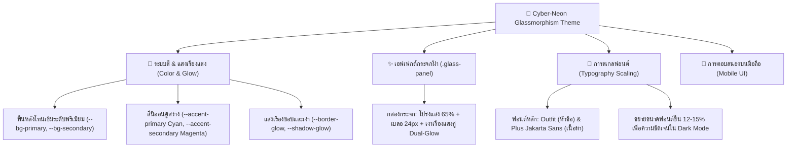

# 🌌 คู่มือระบบการออกแบบ: Cyber-Neon Glassmorphism Theme Guide
## ระบบบันทึกเวลาทำงาน NexTime (NexTime Time Tracking System)

คู่มือฉบับนี้จัดทำขึ้นเพื่อให้นักพัฒนาซอฟต์แวร์และผู้ดูแลระบบเข้าใจหลักการออกแบบ ดีไซน์ซิสเต็ม (Design System) และตัวแปรสไตล์ชีทใหม่ของระบบ **NexTime** ซึ่งใช้รูปแบบ **Premium Dark Mode ร่วมกับ Cyber-Neon Glassmorphism** ที่เน้นความล้ำสมัย (Futuristic), ความโปร่งใสของวัสดุคล้ายกระจกฝ้า (Frosted Glass), และแสงเรืองนีออนโทนคู่ (Electric Cyan & Vibrant Magenta) เพื่อเพิ่มประสบการณ์การใช้งานที่พรีเมียมและสวยงามยิ่งขึ้น

---

## 🏗️ โครงสร้างแนวคิดการออกแบบ (Design Theme Architecture)



---

## 🎨 1. ตัวแปร CSS ในระบบ (CSS Variables Reference)

ตัวแปร CSS ทั้งหมดถูกประกาศไว้ที่ส่วน `:root` ของไฟล์ [index.css](file:///c:/atgv/time_sheet/src/index.css#L3-L56) เพื่อให้เรียกใช้งานได้สะดวกในคอมโพเนนต์ต่าง ๆ

### 1.1 โทนสีพื้นหลังและสีหลัก (Core Palette)
โทนสีพื้นหลังถูกปรับให้มีความลึกและมืดสนิท เพื่อขับเน้นให้แสงเรืองนีออนและข้อความโดดเด่นขึ้นมา

| ตัวแปร CSS | ค่าสี (Hex/RGBA) | คำอธิบายการใช้งาน |
| :--- | :--- | :--- |
| `--bg-primary` | `#06080c` | สีพื้นหลังหลักของเว็บไซต์ (Deep Cosmic Black) |
| `--bg-secondary` | `#0d111a` | สีพื้นหลังของคอมโพเนนต์ย่อย เช่น แถบเมนูด้านข้าง (Sidebar) |
| `--bg-tertiary` | `#141b29` | สีพื้นหลังระดับสาม สำหรับกล่องข้อมูลย่อยหรือปุ่มที่โฮเวอร์ |
| `--bg-glass` | `rgba(13, 17, 26, 0.65)` | สีพื้นหลังโปร่งแสงสำหรับกล่องกระจก (Glass Panel) |

### 1.2 โทนสีเน้นนีออน (Cyber-Neon Accents)
ใช้แนวคิดสีคู่ตรงข้าม (Dual-Tone Accent) เพื่อสร้างมิติและความเป็นไซเบอร์พังก์ที่หรูหรา

| ตัวแปร CSS | ค่าสี (Hex) | สไตล์สี | คำอธิบายการใช้งาน |
| :--- | :--- | :--- | :--- |
| `--accent-primary` | `#00F5FF` | **Electric Cyan** | สีแอคชันหลัก, ปุ่มกดเริ่มต้น, ลิงก์ที่ใช้งานบ่อย, ขอบเรืองแสง |
| `--accent-primary-hover` | `#00D2EB` | **Cyan Darker** | สีแอคชันหลักเมื่อวางเมาส์เหนือส่วนนั้น (Hover State) |
| `--accent-secondary` | `#D946EF` | **Vibrant Magenta** | สีเน้นจุดสำคัญ, ป้ายประกาศพิเศษ, ส่วนประกอบเสริมของเงาเรืองแสง |
| `--accent-danger` | `#EF4444` | **Cyber Red** | ปุ่มลบ, สถานะผิดพลาด, แจ้งเตือนด่วน, จุด Notification |
| `--accent-warning` | `#F59E0B` | **Amber Glow** | สถานะรอการอนุมัติ (Pending), การเตือนระดับกลาง |
| `--accent-info` | `#3B82F6` | **Neon Blue** | ลิงก์ข้อมูลเพิ่มเติม, ป้ายระบุสถานะความรู้ทั่วไป |

### 1.3 ขอบและเงาเรืองแสง (Glow & Glass Shadows)
นี่คือหัวใจสำคัญในการสร้างมิติของดีไซน์ Glassmorphism ที่ผสานแสงส่องสว่างแบบนีออน

```css
/* การประกาศใน index.css */
--border-glass: rgba(0, 245, 255, 0.15);
--border-glow: 1px solid rgba(0, 245, 255, 0.25);
--shadow-glow: 0 0 15px rgba(0, 245, 255, 0.2), 0 0 30px rgba(217, 70, 239, 0.1);
--shadow-glass: 0 8px 32px 0 rgba(0, 0, 0, 0.37);
```

- **`--border-glow`**: ขอบเส้นขนาด 1px ที่เรืองแสงสี Cyan จาง ๆ (25% opacity) เพื่อสร้างขอบเขตที่คมชัดแม้ในมุมมองมืด
- **`--shadow-glow`**: ระบบการฟุ้งกระจายของแสงสะท้อนนีออนแบบสองทิศทาง (Dual Glow) โดยมีสี Cyan แผ่ออกมาในชั้นใน (20% opacity) และสี Magenta ในชั้นนอก (10% opacity)
- **`--shadow-glass`**: เงาสลัวสีดำเข้มช่วยยกให้คอมโพเนนต์ดูลอยขึ้นมาจากพื้นหลังเว็บไซต์

---

## ✨ 2. การใช้งานกล่องกระจก (`.glass-panel`)

คลาส `.glass-panel` เป็นหัวใจของการจัดวางองค์ประกอบข้อมูลบนหน้าจอ เช่น การ์ดแสดงผลสรุป แผงตารางเวลางาน และหน้าจอรายงานผล

### 2.1 CSS Definition
```css
.glass-panel {
  background: var(--bg-glass);                /* โปร่งแสง 65% */
  backdrop-filter: blur(24px);                /* เบลอพื้นหลัง 24px เพื่อให้อ่านง่าย */
  -webkit-backdrop-filter: blur(24px);        /* รองรับ Safari */
  border: var(--border-glow);                 /* ขอบเส้นนีออน Cyan */
  border-radius: var(--radius-lg);            /* ขอบมนระดับใหญ่ (0.75rem หรือ 12px) */
  box-shadow: var(--shadow-glass),            /* เงาดำด้านใต้ */
              var(--shadow-glow);             /* แสงเรืองนีออน Cyan + Magenta */
}
```

> [!IMPORTANT]
> **กฎการอ่านตัวหนังสือ (Readability Rule):**
> ภายใต้การใช้ Glassmorphism ห้ามวางข้อความสีมืดหรือสีขาวทึบโดยไม่มีคอนทราสต์ที่ชัดเจน เนื่องจากเอฟเฟกต์เบลอพื้นหลังอาจะทำให้ตัวหนังสืออ่านยาก ให้ใช้สีตัวอักษร `--text-primary` (`#F1F5F9`) สำหรับหัวข้อหลัก และ `--text-secondary` (`#94A3B8`) สำหรับคำบรรยายเสมอ

### 2.2 ตัวอย่างการประยุกต์ใช้งานในการ์ดคอมโพเนนต์อื่น ๆ (React component)
เมื่อต้องการสร้างการ์ดข้อมูลชุดใหม่ในแผงข้อมูล (Dashboard) หรือหน้ารายงาน (Reports) ให้ใช้โครงสร้างดังนี้:

```jsx
import React from 'react';

export const StatsCard = ({ title, value, change }) => {
  return (
    <div className="glass-panel hover-lift" style={{ padding: '1.5rem' }}>
      <div className="flex-between" style={{ marginBottom: '1rem' }}>
        <span style={{ color: 'var(--text-secondary)', fontSize: 'var(--fs-sm)' }}>
          {title}
        </span>
        <span style={{ color: 'var(--accent-primary)', fontSize: 'var(--fs-xs)', fontWeight: 'bold' }}>
          {change}
        </span>
      </div>
      <h3 className="text-gradient" style={{ fontSize: 'var(--fs-3xl)', fontWeight: 'bold' }}>
        {value}
      </h3>
    </div>
  );
};
```

---

## ⚡ 3. การนำขอบเรืองแสงนีออน (Neon Glow) ไปปรับแต่งเพิ่มเติม

เพื่อควบคุมไม่ให้หน้าจอดูสว่างจ้าจนรบกวนสายตา (Visual Noise) ให้จำกัดขอบเขตการใช้แสงนีออน ดังนี้:

### 3.1 การ์ดขอบเรืองแสงแบบโฮเวอร์ (Interactive Glow Upgrade)
หากต้องการให้การ์ดกระจกมีการเรืองแสงเข้มขึ้นเมื่อผู้ใช้เลื่อนเมาส์ผ่าน (Hover State) สามารถใช้โค้ดดังนี้ในไฟล์ CSS ของหน้าเจาะจง:

```css
.interactive-card {
  transition: all var(--transition-normal);
}

.interactive-card:hover {
  transform: translateY(-4px); /* ยกตัวสูงขึ้น */
  border-color: rgba(0, 245, 255, 0.6); /* ขอบ Cyan สว่างขึ้น */
  box-shadow: 
    var(--shadow-glass),
    0 0 20px rgba(0, 245, 255, 0.4), /* แสงนีออน Cyan เข้มขึ้น */
    0 0 35px rgba(217, 70, 239, 0.2); /* แสงนีออน Magenta แผ่กว้างขึ้น */
}
```

### 3.2 ปุ่มกดสไตล์นีออน (Neon Button Style)
ปุ่มสำคัญที่ต้องการให้ผู้ใช้งานสังเกตได้ง่าย เช่น "บันทึกเวลาทำงาน (Clock In/Out)" หรือ "ส่งแบบฟอร์ม" สามารถเขียน CSS ได้ดังนี้:

```css
.btn-neon-primary {
  background: transparent;
  color: var(--accent-primary) !important;
  border: 1px solid var(--accent-primary);
  border-radius: var(--radius-md);
  padding: 0.75rem 1.5rem;
  font-weight: 600;
  transition: all var(--transition-fast);
  text-shadow: 0 0 8px rgba(0, 245, 255, 0.5); /* เรืองแสงที่ตัวอักษร */
  box-shadow: 0 0 10px rgba(0, 245, 255, 0.15);
}

.btn-neon-primary:hover {
  background: var(--accent-primary);
  color: var(--bg-primary) !important; /* สลับสีให้เด่นชัด */
  box-shadow: 0 0 20px rgba(0, 245, 255, 0.45);
  text-shadow: none;
}
```

---

## 📝 4. คำแนะนำเรื่องการสเกลขนาดตัวอักษร (Typography Scaling)

จากการปรับปรุงสไตล์ล่าสุด ขนาดฟอนต์ได้ถูก**สเกลเพิ่มขึ้นประมาณ 12% - 15%** ทั่วทั้งระบบ เพื่อลดการเพ่งสายตาของพนักงานที่บันทึกข้อมูลเวลางานและเพิ่มความชัดเจนในการอ่านค่าบนพื้นหลังแบบมืด (Dark Mode Readability)

### 4.1 ตารางเปรียบเทียบและการนำขนาดฟอนต์ไปใช้

| ตัวแปรขนาดฟอนต์ | ขนาดสเกลใหม่ | การนำไปประยุกต์ใช้งานในระบบ |
| :--- | :--- | :--- |
| `--fs-xs` | `0.85rem` | สำหรับข้อมูลขนาดเล็กมาก เช่น แท็กป้ายกำกับ, ป้ายสถานะของงานย่อยบนการ์ดคันบัง (Kanban cards) |
| `--fs-sm` | `0.95rem` | ข้อความรอง, คำอธิบายฟิลด์ข้อมูล, รายละเอียดขนาดสั้นในการแสดงผล |
| `--fs-base` | `1.05rem` | **ฟอนต์เริ่มต้น (Base Body Text)**, ข้อความในปุ่มทั้งหมด, รายการตาราง (Table cell data), ข้อความใน Sidebar |
| `--fs-lg` | `1.15rem` | หัวข้อย่อยระดับ 5 (`h5`), เมนูหลัก, หัวข้อการ์ดรายงาน |
| `--fs-xl` | `1.30rem` | หัวข้อย่อยระดับ 4 (`h4`), ชื่อหมวดหมู่ใหญ่, หัวตารางสรุปการวิเคราะห์ |
| `--fs-2xl` | `1.70rem` | หัวข้อย่อยระดับ 3 (`h3`), หัวเรื่องบนการ์ดสถิติ, ส่วนหัวการจัดหน้าแบบโมดอล (Modals) |
| `--fs-3xl` | `2.10rem` | หัวข้อย่อยระดับ 2 (`h2`), หัวข้อหลักประจำหน้าจอแอปพลิเคชัน (Page Header) |
| `--fs-4xl` | `2.50rem` | หัวข้อระดับ 1 (`h1`), หน้าจอแสดงผลตัวเลขสำคัญหลัก (Hero section metrics) |

> [!TIP]
> **กฎการบังคับใช้ตัวอักษรในส่วนประกอบหลัก (Core UI Text Enforcement):**
> สังเกตว่าใน [index.css:L177-191](file:///c:/atgv/time_sheet/src/index.css#L177-L191) ได้มีการใช้ `!important` เพื่อรับประกันว่าขนาดอักษรใน ปุ่ม (`button`), ตาราง (`table`), แถบด้านข้าง (`sidebar`), และฟิลด์กรอกข้อมูล (`input`, `select`, `textarea`) จะถูกสเกลขึ้นมาเป็น `var(--fs-base)` (1.05rem) อย่างสม่ำเสมอทั่วทุกที่เพื่อป้องกันการเพี้ยนของสเกล

### 4.2 ข้อยกเว้นการลดระดับอักษรบนหน้าจอเล็ก (Micro Component Adjustment)
สำหรับองค์ประกอบที่มีพื้นที่จำกัด เช่น **การ์ดคันบังบอร์ด (Kanban Cards)** ขนาดฟอนต์จะถูกปรับลงเฉพาะที่เพื่อไม่ให้การ์ดมีขนาดยาวเกินไปบนบอร์ด:
- หัวข้อการ์ด: ใช้ `var(--fs-base) !important`
- คำอธิบายรายละเอียดงาน (Paragraph): ใช้ `var(--fs-sm) !important`
- แท็กป้ายกำกับและดรอปดาวน์เลือกพนักงาน: ใช้ `var(--fs-xs) !important`

---

## 📱 5. การรองรับหน้าจอและการแสดงผลที่ตอบสนอง (Responsive Design)

เพื่อให้นักพัฒนาคนอื่นนำคลาสดีไซน์เหล่านี้ไปประยุกต์ใช้ในโมบายได้อย่างเหมาะสม ขออธิบายกลไกการสลับสไตล์แบบย่อเมื่อหน้าจอมีขนาดความกว้าง **ไม่เกิน 768px** ดังนี้:

1. **กล่องกระจกคันบังบนมือถือ:** คลาส `.kanban-board` จะปรับเปลี่ยนเป็นสเกลแบบกวาดนิ้วแนวนอนอัตโนมัติ (`overflow-x: auto`) และการ์ดข้างในถูกกำหนดขนาดขั้นต่ำไว้ที่ `280px`
2. **การปรับเป็นกริดแถวเดียว:** ปรับใช้คุณสมบัติ `grid-template-columns: 1fr !important` ใน `.dashboard-row` และ `.timesheet-row` เพื่อบังคับให้คอมโพเนนต์กระจกเรียงตัวซ้อนกันในแนวตั้ง
3. **แถบนำทางส่วนล่างมือถือ (`.mobile-bottom-nav`):** จะแสดงผลอัตโนมัติโดยใช้พื้นหลังกระจกฝ้าโปร่งแสง (`rgba(22, 26, 34, 0.95)`) และมีขอบด้านบนเป็นกระจกเรืองแสงบาง ๆ เพื่อแยกเนื้อหากลางหน้าจอให้ชัดเจน

---

## 📥 6. ตัวอย่างการคัดลอกส่วนโค้งดีไซน์ไปใช้งานในทันที (Template Snippets)

### 6.1 โค้ด JSX/React สำหรับสร้างหน้าบันทึกเวลากระจกนีออน (Dashboard Component)

```jsx
import React from 'react';
import './index.css';

export default function ClockInPanel() {
  return (
    <div className="glass-panel hover-lift" style={{ padding: '2rem', maxWidth: '450px', margin: '2rem auto' }}>
      <h2 style={{ marginBottom: '0.5rem', textAlign: 'center' }}>
        บันทึกเวลาทำงาน <span className="text-gradient">NexTime</span>
      </h2>
      <p style={{ color: 'var(--text-secondary)', fontSize: 'var(--fs-sm)', textAlign: 'center', marginBottom: '1.5rem' }}>
        กดปุ่มด้านล่างเพื่อ Clock In / Clock Out ของวันนี้
      </p>
      
      <div style={{ display: 'flex', flexDirection: 'column', gap: '1rem' }}>
        {/* ช่องฟิลด์เลือกโครงการ - สไตล์ Dark Glass */}
        <div>
          <label style={{ display: 'block', marginBottom: '0.5rem', fontSize: 'var(--fs-sm)' }}>เลือกโครงการที่รับผิดชอบ</label>
          <select className="glass-select" style={{ width: '100%', padding: '0.75rem', borderRadius: 'var(--radius-md)', background: 'var(--bg-secondary)', border: '1px solid var(--border-color)', color: 'var(--text-primary)' }}>
            <option value="proj-1">NexTime Redesign Project</option>
            <option value="proj-2">Enterprise HR Suite Integration</option>
          </select>
        </div>
        
        {/* ปุ่ม Clock In แบบเรืองแสงนีออนปุ่มหลัก */}
        <button className="btn" style={{
          background: 'linear-gradient(90deg, var(--accent-primary), var(--accent-secondary))',
          color: 'var(--bg-primary)',
          border: 'none',
          padding: '1rem',
          borderRadius: 'var(--radius-md)',
          fontWeight: 'bold',
          cursor: 'pointer',
          boxShadow: 'var(--shadow-glow)',
          transition: 'transform 0.2s'
        }}
        onMouseOver={(e) => e.target.style.transform = 'scale(1.02)'}
        onMouseOut={(e) => e.target.style.transform = 'scale(1)'}
        >
          ⏰ Clock In เข้าระบบบันทึกเวลา
        </button>
      </div>
    </div>
  );
}
```

---
**จัดทำโดย:** ระบบจัดเตรียมคู่มือการอบรมดีไซน์ NexTime (agent_trainer)  
**อัปเดตล่าสุด:** 16 มิถุนายน 2026
