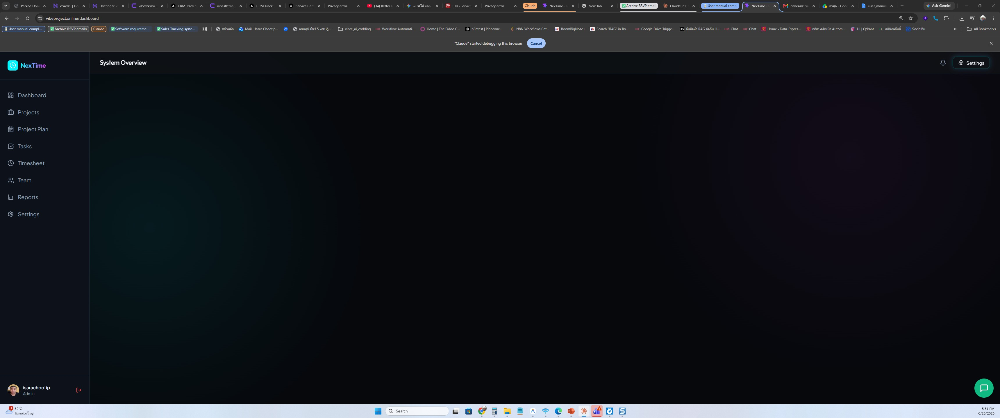
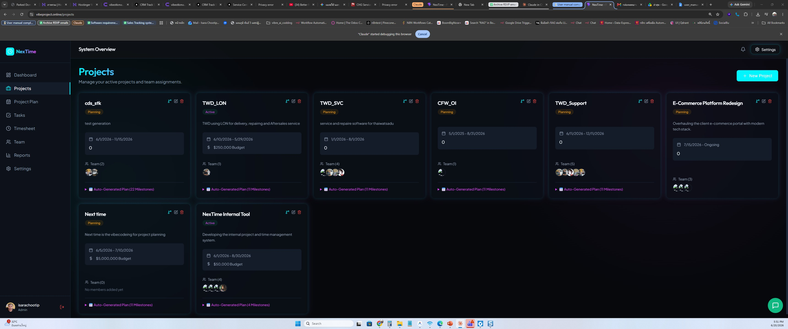
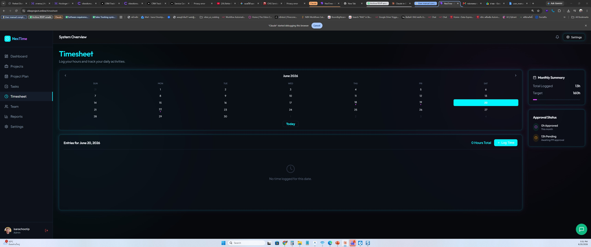
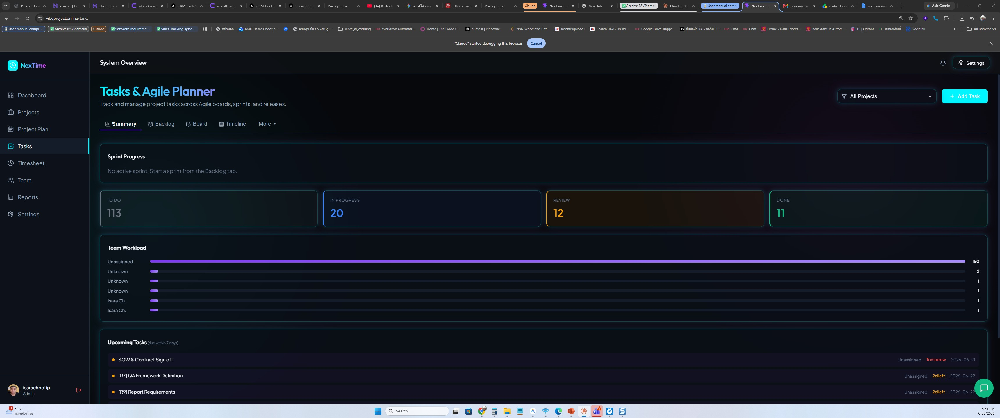
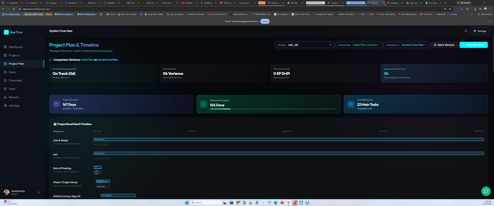
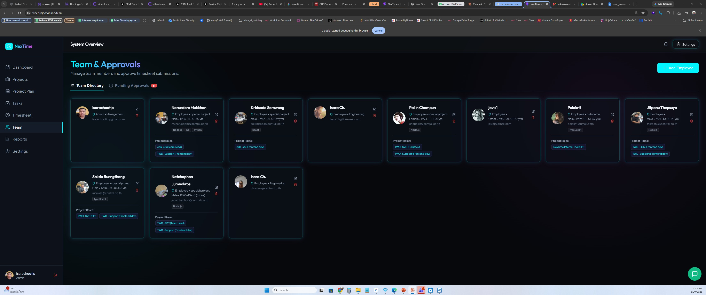
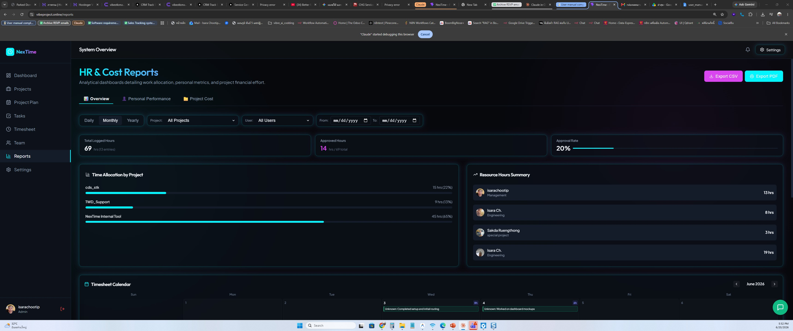
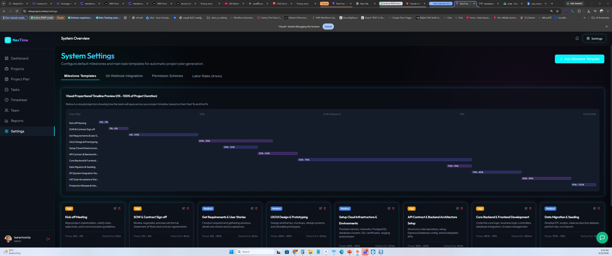

# คู่มือการใช้งานระบบ NexTime (Project & Timesheet Management System)

> **NexTime** เป็นระบบเว็บแอปพลิเคชันระดับองค์กรสำหรับบริหารจัดการโครงการ (Project Management), บันทึกเวลาทำงาน (Timesheet Logging), วางแผนการทำงานแบบอไจล์ (Agile Kanban Board, Sprints & Releases), และการตรวจสอบอนุมัติเวลางานของทีมงานอย่างมีประสิทธิภาพ เชื่อมต่อความปลอดภัยผ่าน LINE Login (และมีแผนรองรับระบบการตรวจสอบสิทธิ์แบบ 2 ปัจจัย หรือ 2FA ในอนาคต) พร้อมดีไซน์สุดพรีเมียมในรูปแบบ Dark Mode และ Glassmorphism

---

## 📖 สารบัญ
1. [การลงชื่อเข้าใช้งานระบบ (Authentication)](#-1-การลงชื่อเข้าใช้งานระบบ-authentication)
2. [โครงสร้างสิทธิ์การใช้งาน (Roles & Permissions)](#-2-โครงสร้างสิทธิ์การใช้งาน-roles--permissions)
3. [เริ่มต้นใช้งานอย่างรวดเร็ว (Quick Start Guide)](#-3-เริ่มต้นใช้งานอย่างรวดเร็ว-quick-start-guide)
4. [หน้าภาพรวมระบบ (Dashboard)](#-4-หน้าภาพรวมระบบ-dashboard)
5. [การจัดการโครงการ (Project Management)](#-5-การจัดการโครงการ-project-management)
6. [การบันทึกชั่วโมงทำงาน (Timesheet - สำหรับพนักงาน)](#️-6-การบันทึกชั่วโมงทำงาน-timesheet)
7. [บอร์ดจัดการงานทีม (Agile Kanban Board - สำหรับทีมและ PM)](#-7-บอร์ดจัดการงานทีม-agile-kanban-board)
   - [คอลัมน์และสถานะของงานย่อย](#คอลัมน์และสถานะของงานย่อย-workflow-columns)
   - [การจัดระดับความสำคัญของงาน (Priority)](#การจัดระดับความสำคัญของงาน-priority-color-coding)
   - [Agile Sprints & Backlog Planner](#agile-sprints--backlog-planner)
   - [Release Management (รุ่นและการออกเวอร์ชัน)](#release-management-รุ่นและการออกเวอร์ชัน)
8. [ระบบแผนงานและแผนภูมิแกนต์ (Project Plan & Gantt Chart)](#-8-ระบบแผนงานและแผนภูมิแกนต์-project-plan--gantt-chart)
9. [การอนุมัติเวลาทำงานและการจัดการพนักงาน (Approvals & Employee Management - สำหรับ PM/Admin)](#-9-การอนุมัติเวลาทำงานและการจัดการพนักงาน-approvals--employee-management)
10. [รายงานและกราฟสถิติ (Reports)](#-10-รายงานและกราฟสถิติ-reports)
11. [การตั้งค่าและการเชื่อมต่อระบบ Git (Settings & Git Webhooks - สำหรับ Admin/Dev)](#️-11-การตั้งค่าและการเชื่อมต่อระบบ-git-settings--git-webhooks)
12. [ระบบแจ้งเตือนทางอีเมล (Email Notifications)](#️-12-ระบบแจ้งเตือนทางอีเมล-email-notifications)
13. [คำถามที่พบบ่อย (FAQ & Troubleshooting)](#-13-คำถามที่พบบ่อย-faq--troubleshooting)

---

## 🔑 1. การลงชื่อเข้าใช้งานระบบ (Authentication)

ระบบ NexTime ถูกออกแบบมาให้มีความปลอดภัยและใช้งานง่าย โดยสนับสนุนช่องทางการเข้าสู่ระบบ 2 รูปแบบดังนี้:

### A. ลงชื่อเข้าใช้งานด้วย LINE (LINE Login)
1. ในหน้าหลัก ให้คลิกปุ่ม **"Sign in with LINE"**
2. ระบบจะเปลี่ยนเส้นทางไปยังหน้าลงทะเบียน/เข้าใช้งานของ LINE โดยตรง
3. ทำการสแกน **QR Code** หรือกรอกอีเมลและรหัสผ่านของบัญชี LINE
4. **การจับคู่โปรไฟล์อัตโนมัติ (Auto-binding):** ระบบจะตรวจดูอีเมลบริษัทที่ลงทะเบียนไว้ในฐานข้อมูล หากตรงกันกับอีเมลในบัญชี LINE ระบบจะทำการเชื่อมโยงข้อมูลและนำเข้าสู่หน้าแดชบอร์ดโดยอัตโนมัติ

> [!WARNING]
> บัญชี LINE ของคุณต้องใช้**อีเมลบริษัท**ที่ลงทะเบียนไว้ในระบบ หรือตรงกับโปรไฟล์ที่ Admin สร้างขึ้น หากมีปัญหาล็อกอินและแสดงข้อความแจ้งเตือนสีแดง *⚠️ ล็อกอินไม่สำเร็จ / Sign in Failed (unauthorized)* กรุณาติดต่อแอดมินประจำระบบเพื่อยืนยันข้อมูลอีเมลของท่าน

### B. ระบบการตรวจสอบสิทธิ์แบบ 2 ปัจจัย (2-Factor Authentication - OTP) [แผนงานในอนาคต]
ตามข้อเสนอแนะเชิงดีไซน์ในคู่มือระบบ (system_setup.md) ระบบได้ออกแบบโครงสร้างรองรับการทำ 2FA ผ่านทางอีเมลบริษัทไว้ดังนี้ (ปัจจุบันยังไม่ได้เปิดใช้งานในระบบจริง):
1. **การเข้าใช้งานครั้งแรก:** พนักงานเข้าใช้ระบบผ่าน LINE Login จากนั้นระบุอีเมลบริษัท
2. **การส่ง OTP:** ระบบจะส่งรหัส **OTP 6 หลัก** ไปยังอีเมลบริษัทเพื่อยืนยันความเป็นพนักงานจริง
3. **การผูกบัญชี:** เมื่อกรอกรหัสถูกต้อง ระบบจึงจะผูก LINE User ID เข้ากับฐานข้อมูลโดยสมบูรณ์ เพื่อลดความจำเป็นในการแชร์ข้อมูลส่วนบุคคลจาก LINE โดยไม่จำเป็น

### C. บัญชีทดลองระดับผู้พัฒนา (Demo Account Switcher - เฉพาะ Local Dev)
หากรันระบบบนสภาพแวดล้อม `localhost` หรือ `127.0.0.1` ระบบจะแสดงส่วนช่วยเหลือพิเศษ **"Or sign in with Demo Account (Dev Only)"** เพื่อให้ผู้พัฒนาระบบสามารถเปลี่ยนบทบาท (Admin, Manager/PM, Employee) ไปมาได้อย่างรวดเร็ว เพื่อทำการทดสอบฟังก์ชันงาน

---

## 👥 2. โครงสร้างสิทธิ์การใช้งาน (Roles & Permissions)

เพื่อความเป็นระเบียบในการบริหารจัดสรรทรัพยากร ระบบแบ่งสิทธิ์ผู้ใช้ออกเป็น 2 เลเยอร์:

### 1. สิทธิ์ระดับระบบ (Global Role)
* **Admin (ผู้ดูแลระบบ):**
  * สิทธิ์สูงสุดในการเข้าถึงทุกโมดูล
  * จัดการข้อมูลส่วนตัวและสิทธิ์ของพนักงานทุกคนในระบบ
  * สร้างโปรเจกต์ใหม่และแก้ไขรายละเอียดได้ทุกโปรเจกต์
  * ตั้งค่าและลบ **Milestone Templates (แม่แบบแผนงาน)**
  * ตรวจสอบและอนุมัติเวลางานของทุกคนในบริษัท
* **Manager / Owner:**
  * เหมาะสำหรับผู้บริหารโครงการหรือเจ้าของงานหลัก
  * สามารถสร้างโปรเจกต์ใหม่ และดูแลความคืบหน้าของโครงการต่าง ๆ ที่ตนเป็นเจ้าของ
  * เข้าดูรายงานภาพรวมสะสมของทั้งแผนกได้
* **Employee (พนักงานทั่วไป):**
  * พนักงานฝ่ายปฏิบัติงาน เช่น SA, Developer, Designer, QA
  * สามารถล็อกอิน บันทึกเวลางานส่วนตัว (Timesheet) ของตนเอง และส่งคำขออนุมัติ
  * เข้าใช้งานบอร์ดงานทีมเพื่ออัปเดตสถานะของตนเอง

### 2. บทบาทระดับโครงการ (Project Role)
* **PM (Project Manager - ประจำโครงการ):**
  * เป็นแอดมินดูแลความเรียบร้อยของโปรเจกต์ย่อยนั้น ๆ
  * เพิ่มหรือลดสมาชิกในทีม คัดเลือกผู้ปฏิบัติงานในโครงการ
  * ตรวจสอบรายละเอียดและ**อนุมัติ/ปฏิเสธเวลางาน (Timesheet Approvals)** ของสมาชิกร่วมโครงการ (จะไม่มีสิทธิ์เข้าไปยุ่งกับข้อมูลโปรเจกต์อื่นที่ไม่ได้สังกัด)
* **Team Lead / Member (หัวหน้าทีม / สมาชิกโครงการ):**
  * ผู้ปฏิบัติงานตามหน้าที่ที่ได้รับมอบหมาย
  * อัปเดตและเคลื่อนย้ายการ์ดงานบนบอร์ด และบันทึกเวลาที่ใช้จริงลงรายวัน

### 3. ตารางสรุปสิทธิ์การใช้งาน (Permission Matrix)

| ฟังก์ชัน | Admin | Manager | PM | Employee |
| :--- | :---: | :---: | :---: | :---: |
| สร้าง/แก้ไขโปรเจกต์ | ✅ | ✅ | ❌ | ❌ |
| เพิ่ม/ลบสมาชิกโปรเจกต์ | ✅ | ✅ | ✅ | ❌ |
| บันทึกเวลางาน (Timesheet) | ✅ | ✅ | ✅ | ✅ |
| อนุมัติเวลางาน (Approvals) | ✅ | ❌ | ✅ | ❌ |
| ดูรายงานทุกทีม | ✅ | ✅ | ❌ | ❌ |
| ตั้งค่า Milestone Templates | ✅ | ❌ | ❌ | ❌ |
| จัดการข้อมูลพนักงาน | ✅ | ❌ | ❌ | ❌ |
| ตั้งค่า Git Webhooks | ✅ | ❌ | ❌ | ❌ |
| ดู Kanban Board | ✅ | ✅ | ✅ | ✅ |
| สร้าง/จัดการ Sprint | ✅ | ✅ | ✅ | ❌ |

---

## 🚀 3. เริ่มต้นใช้งานอย่างรวดเร็ว (Quick Start Guide)

### สำหรับพนักงานใหม่ (Employee)
1. ติดต่อ Admin เพื่อให้เพิ่มอีเมลบริษัทของคุณเข้าระบบก่อน
2. เข้าสู่ระบบด้วย **LINE Login** โดยใช้บัญชี LINE ที่ผูกกับอีเมลบริษัท
3. ตรวจสอบว่าชื่อและรูปโปรไฟล์ถูกต้องบนหน้า Dashboard
4. เข้าหน้า **Timesheet** เพื่อเริ่มบันทึกเวลาทำงานในโครงการที่สังกัด
5. เข้าหน้า **Tasks (Kanban Board)** เพื่อดูงานที่ได้รับมอบหมาย และอัปเดตสถานะงาน

### สำหรับผู้จัดการโครงการ (PM / Manager) ที่ตั้งระบบครั้งแรก
1. **Admin สร้างโปรเจกต์** พร้อมระบุวันเริ่ม/สิ้นสุด และเลือก Milestone Template
2. **กำหนด PM** ประจำโครงการในหน้า Project Settings
3. **เพิ่มสมาชิกทีม** เข้าโครงการ
4. PM **สร้าง Sprint** แรกและดึงงานจาก Backlog มาวางแผน
5. ทีมเริ่มทำงาน: อัปเดตการ์ดบนบอร์ด + บันทึกเวลาทุกวัน
6. PM **ตรวจและอนุมัติเวลา** ของทีมเป็นระยะ

---

## 📊 4. หน้าภาพรวมระบบ (Dashboard)



หน้าภาพรวมเป็นจุดแรกของการเริ่มต้นทำงาน ซึ่งได้รับการดีไซน์สไตล์ล้ำสมัยแบบ Dark Mode และกระจกใสโปร่งแสง (Glassmorphism) มีส่วนสำคัญดังนี้:

```
┌─────────────────────────────────────────────────────────────────┐
│  NexTime                                     👤 [User Profile]  │
├────────────┬────────────────────────────────────────────────────┤
│            │  📊 DASHBOARD                                       │
│  📊 Dashboard│                                                   │
│  📁 Projects│  ┌──────────┐  ┌──────────┐  ┌──────────┐        │
│  ⏱ Timesheet│  │ 248 hrs  │  │  5 Active│  │ 12 Pend. │        │
│  ✅ Approvals│  │Total Hrs │  │ Projects │  │Approvals │        │
│  📈 Reports │  └──────────┘  └──────────┘  └──────────┘        │
│  ⚙ Settings│                                                    │
│            │  Recent Activity                                    │
│            │  • Somchai logged 8h on "Web Development"          │
│            │  • Kanisa moved Task #45 to Review                  │
└────────────┴────────────────────────────────────────────────────┘
```

### ส่วนประกอบของ Dashboard

* **สถิติวัดผลสำคัญ (Key Metrics):**
  * **Total Hours:** ผลรวมชั่วโมงที่บันทึกและอนุมัติแล้วในโครงการปัจจุบัน
  * **Active Projects:** จำนวนโครงการทั้งหมดที่กำลังเปิดดำเนินการอยู่ในสถานะ Active
  * **Pending Approvals:** แจ้งจำนวนคำขอบันทึกชั่วโมงทำงานของทีมงานที่ค้างอนุมัติอยู่ (แสดงผลเฉพาะ PM/Admin)
* **Recent Activity Feed (ประวัติกิจกรรมล่าสุด):** แสดงประวัติความเคลื่อนไหวในระบบ เช่น ใครเป็นคนบันทึกเวลาล่าสุด หรือมีใครขยับการ์ดงานชิ้นใด ช่วยให้คนในทีมรู้ความคืบหน้าในทันที

### เมนูนำทางหลัก (Sidebar Navigation)
แถบเมนูด้านซ้ายมือแสดงเส้นทางนำทางหลักของระบบ:

| เมนู | คำอธิบาย | สิทธิ์ที่มองเห็น |
| :--- | :--- | :--- |
| 📊 Dashboard | หน้าภาพรวมสถิติ | ทุกคน |
| 📁 Projects | รายการโครงการทั้งหมด | ทุกคน |
| ⏱ Timesheet | บันทึกชั่วโมงทำงาน | ทุกคน |
| ✅ Approvals | อนุมัติเวลางาน | PM / Admin |
| 📈 Reports | รายงานและกราฟ | Manager / Admin |
| ⚙ Settings | ตั้งค่าระบบ | Admin |

---

## 📁 5. การจัดการโครงการ (Project Management)



### A. การดูรายการโครงการทั้งหมด (Projects List)
เมื่อกดเมนู **Projects** ระบบจะแสดงรายการโปรเจกต์ทั้งหมดที่คุณมีสิทธิ์เข้าถึง แสดงข้อมูลสรุป เช่น ชื่อโปรเจกต์, ความคืบหน้า (%), สมาชิกในทีม และวันสิ้นสุด

```
┌────────────────────────────────────────────────────────────────┐
│  Projects                                    [+ New Project]   │
├────────────────────────────────────────────────────────────────┤
│  🟢 Web Platform Redesign          Progress: ████░░ 65%        │
│     Team: 5 members  |  Due: 30 Sep 2026  |  PM: Somchai       │
├────────────────────────────────────────────────────────────────┤
│  🔵 Mobile App v2.0                Progress: ██░░░░ 30%        │
│     Team: 3 members  |  Due: 15 Dec 2026  |  PM: Kanisa        │
├────────────────────────────────────────────────────────────────┤
│  ⚪ Internal HR System             Progress: ░░░░░░  0%        │
│     Team: 2 members  |  Due: 28 Feb 2027  |  PM: Wirat         │
└────────────────────────────────────────────────────────────────┘
```

### B. การสร้างโครงการใหม่ (Create New Project) — เฉพาะ Admin/Manager
1. กดปุ่ม **"+ New Project"** มุมขวาบนของหน้า Projects
2. กรอกข้อมูลโครงการ:
   * **Project Name:** ชื่อโครงการ
   * **Description:** รายละเอียดและวัตถุประสงค์โครงการ
   * **Start Date:** วันที่เริ่มต้นโครงการ
   * **End Date:** วันที่คาดว่าจะแล้วเสร็จ
   * **Milestone Template:** เลือกแม่แบบแผนงาน (ถ้ามี) เพื่อสร้าง Milestone อัตโนมัติตามสัดส่วนช่วงเวลา
3. กดปุ่ม **Save / Create**
4. ระบบสร้างโปรเจกต์และ Milestone ย่อยอัตโนมัติตาม Template ที่เลือก

> [!NOTE]
> หากไม่เลือก Milestone Template ระบบจะสร้างโปรเจกต์เปล่า PM สามารถเพิ่ม Milestone ด้วยตนเองในภายหลังได้

### C. การเข้าใช้งานภายในโครงการ (Project Detail View)
เมื่อคลิกที่โปรเจกต์ใด ระบบจะนำเข้าสู่หน้ารายละเอียดโปรเจกต์ ซึ่งมีแท็บย่อยดังนี้:

| แท็บ | เนื้อหา |
| :--- | :--- |
| **Overview** | ข้อมูลสรุป สมาชิก และความคืบหน้าโดยรวม |
| **Tasks** | Kanban Board, Sprint Planner, Release Management |
| **Plan** | Gantt Chart และแผนงาน Milestone |
| **Timesheet** | บันทึกชั่วโมงทำงานที่เชื่อมกับโปรเจกต์นี้ |
| **Reports** | รายงานสถิติเฉพาะโปรเจกต์ |
| **Settings** | ตั้งค่าโปรเจกต์, จัดการสมาชิก, เชื่อมต่อ Git |

### D. การจัดการสมาชิกโปรเจกต์ (Team Members)
ใน **Project Settings > Members:**
1. กดปุ่ม **"Add Member"** และค้นหาพนักงานที่ต้องการเพิ่ม
2. กำหนดบทบาทระดับโปรเจกต์: `PM`, `Team Lead`, หรือ `Member`
3. สมาชิกจะสามารถเข้าถึงบอร์ด Kanban, Timesheet และ Plan ของโปรเจกต์นี้ทันที
4. หากต้องการลบสมาชิก ให้กดไอคอนลบ (🗑) ข้างชื่อ และยืนยัน

### E. การแก้ไขและการเก็บถาวรโครงการ (Edit & Archive)
* **แก้ไขโปรเจกต์:** Admin หรือ Manager กดไอคอนดินสอ (✏️) บนหน้า Projects แล้วแก้ไขข้อมูล
* **เก็บถาวร (Archive):** เมื่อโปรเจกต์เสร็จสิ้น สามารถเปลี่ยนสถานะเป็น `Archived` เพื่อซ่อนจาก Active List แต่ยังคงประวัติข้อมูลไว้สมบูรณ์

---

## ⏱️ 6. การบันทึกชั่วโมงทำงาน (Timesheet)



พนักงานฝ่ายปฏิบัติงานใช้หน้านี้สำหรับลงบันทึกเวลาทำงานรายวันของตนเองเพื่อนำไปคำนวณต้นทุนและความก้าวหน้าของโครงการ

```
┌──────────────────────────────────────────────────────────┐
│  [Mon 08]  [Tue 09]  [Wed 10]  [Thu 11]  [Fri 12]        │ <-- Week Navigation
├──────────────────────────────────────────────────────────┤
│ Entries for Wednesday, June 10, 2026      [Total: 8 hrs] │
│ ──────────────────────────────────────────────────────── │
│ • Web Development  - Dashboard CSS Design     (4h) [Draft]│
│ • Database Setup   - Schema Migrations        (4h) [Pend.]│
└──────────────────────────────────────────────────────────┘
```

### ขั้นตอนการบันทึกเวลางานรายวัน:
1. ไปที่เมนู **Timesheet**
2. เลือกวันที่ต้องการบันทึกเวลาผ่านปุ่มนำทางรายสัปดาห์ (**Week Navigation** ด้านบน)
3. คลิกปุ่ม **"Log Time"** มุมขวาบนเพื่อเปิดหน้าต่างป้อนข้อมูล
4. กรอกรายละเอียดดังนี้:
   * **Project:** เลือกโครงการที่สังกัด
   * **Task:** เลือกงานย่อยในโครงการนั้น (หากไม่มีให้เลือกประเภททั่วไป หรือ General)
   * **Hours:** จำนวนชั่วโมงที่ใช้จริงในงานนั้น
   * **Description:** คำอธิบายรายละเอียดสั้น ๆ เกี่ยวกับงานที่ได้ทำลงไป
5. เลือกสถานะตั้งต้น:
   * หากยังต้องการแก้ไขต่อ ให้เลือกบันทึกเป็น `Draft`
   * หากต้องการส่งตรวจทันที ให้เลือกบันทึกส่งสถานะ `Pending` เพื่อรอ PM อนุมัติ
6. คลิก **Save**

### ความหมายของสถานะเวลางาน (Timesheet Statuses):
| สถานะ | ความหมาย | สิทธิ์ในการจัดการ |
| :---: | :--- | :--- |
| **Draft** | ข้อมูลร่าง พนักงานบันทึกไว้ชั่วคราว | พนักงานสามารถ **แก้ไข (Edit)** หรือ **ลบ (Delete)** ได้ตามปกติ |
| **Pending** | ส่งคำขอไปยัง PM/Admin รอการตรวจเช็ก | ข้อมูลจะถูกล็อก **ไม่สามารถแก้ไขหรือลบได้** ระหว่างรอผลการตรวจ |
| **Approved** | ผ่านการอนุมัติและบันทึกเวลาเข้าระบบเรียบร้อย | มีเครื่องหมายขีดถูกสีเขียว ข้อมูลจะถูกล็อกถาวรและส่งไปใช้คำนวณสถิติต่าง ๆ |
| **Rejected** | ถูก PM ปฏิเสธการบันทึกเวลา | จะแสดงไอคอนกากบาทสีแดงพร้อม**ข้อความปฏิเสธ (Reject Reason)** พนักงานสามารถแก้ไขข้อมูลและส่งใหม่อีกครั้งได้ |

### เคล็ดลับการบันทึกเวลา (Best Practices)
* บันทึกเวลาทุกวันหรืออย่างน้อยทุกสิ้นสัปดาห์ เพื่อความแม่นยำ
* หากทำงานหลายโปรเจกต์ในวันเดียว ให้แยกบันทึกทีละรายการ
* ระบุ Description ให้ชัดเจน เพื่อช่วยให้ PM อนุมัติได้เร็วขึ้น
* สถานะ `Draft` ที่ค้างนานเกินไปอาจถูก Admin ย้อนถามในรายงาน

---

## 📋 7. บอร์ดจัดการงานทีม (Agile Kanban Board)




แท็บ **Tasks** เป็นศูนย์กลางการสื่อสารและจัดการงานย่อยภายในทีม โดยแบ่งแท็บการดำเนินงานภายในออกเป็น 3 ส่วนย่อย (Sub-Tabs):

```
┌─────────────────────────────────────────────────────────────────────┐
│  [Board]  [Sprint Planner]  [Releases]                              │
├──────────────┬────────────────┬──────────────┬──────────────────────┤
│   TO DO      │  IN PROGRESS   │   REVIEW     │      DONE            │
├──────────────┼────────────────┼──────────────┼──────────────────────┤
│ 🔴[Bug]      │ 🔵[Task]       │ 🟢[Story]    │ 🔵[Task]             │
│ Login Error  │ Setup DB Index │ User Auth    │ Dark Mode UI         │
│ 2h · @Dev1  │ 4h · @Dev2    │ 12h · @Dev3  │ 8h · @Design1        │
│              │                │              │                      │
│ ⚪[Task]     │ 🟡[Story]      │              │                      │
│ Write Docs   │ LINE OAuth     │              │                      │
│ 8h · @PM1   │ 8h · @Dev1    │              │                      │
└──────────────┴────────────────┴──────────────┴──────────────────────┘
```

### คอลัมน์และสถานะของงานย่อย (Workflow Columns)
บอร์ดจัดเก็บการ์ดงานและแสดงตามสถานะงาน 4 คอลัมน์หลัก โดยใช้ไลบรารีดึง-ลากพิเศษ (dnd-kit) ที่ลื่นไหล:
1. **To Do (รอดำเนินการ):** งานใหม่ที่เตรียมนำมาทำ
2. **In Progress (กำลังทำ):** งานที่พนักงานกำลังลงมือดำเนินการอยู่ในปัจจุบัน
3. **Review (รอตรวจ):** งานที่ดำเนินการพัฒนาเสร็จแล้ว รอหัวหน้าทีมตรวจสอบความเรียบร้อย
4. **Done (เสร็จสิ้น):** งานที่ผ่านการรับรองและเสร็จสมบูรณ์ร้อยละ 100

### การย้ายการ์ดงาน (Moving Cards)
* **ดึง-ลาก (Drag & Drop):** ลากการ์ดงานข้ามคอลัมน์ได้โดยตรงบนบอร์ด
* **เปลี่ยนสถานะในการ์ด:** เปิดรายละเอียดการ์ด แล้วเปลี่ยน Status จาก Dropdown ภายใน

### การจัดระดับความสำคัญของงาน (Priority Color Coding)
ขอบการ์ดซ้ายมือจะระบุสีสะท้อนความด่วนของงานในบอร์ด เพื่อจัดลำดับความสำคัญของเวลา:
* 🔴 **สีแดง (Urgent):** งานด่วนวิกฤต ต้องรีบทำทันที เช่น บั๊กที่พบบนระบบจริง
* 🟡 **สีเหลือง (High):** งานสำคัญหลักที่มีผลกระทบต่อเป้าหมายตามไทม์ไลน์
* 🔵 **สีฟ้า (Medium):** งานพัฒนาฟังก์ชันทั่วไปตามรอบสปรินต์ปกติ
* ⚪ **สีเทา (Low):** งานย่อยที่ปรับแต่งทีหลังได้ ไม่เร่งรีบ

### ข้อมูลรายละเอียดภายในการ์ดงาน (Task Card Properties)
เมื่อสร้างหรือกดดูรายละเอียดของการ์ดงาน จะมีช่องข้อมูลดังนี้:
* **Issue Type (ประเภทงาน):** ระบุประเภทด้วยสีและไอคอนเฉพาะ
  * 🔴 `Bug` (ข้อบกพร่องระบบ)
  * 🟢 `Story` (ฟีเจอร์ผู้ใช้งาน)
  * 🔵 `Task` (งานทั่วไป)
  * 🟣 `Sub-task` (งานย่อย)
* **Story Points:** คะแนนความยากง่ายของงานย่อย (สำหรับวางแผนปริมาณงาน)
* **Estimated Hours:** การประเมินชั่วโมงการทำงาน
* **Assignee:** รูปภาพแสดงโปรไฟล์ผู้รับผิดชอบงาน
* **Checklist:** รายการย่อยที่ต้องกดขีดฆ่าเมื่อทำเสร็จทีละขั้น

### การสร้างงานใหม่ (Create Task)
1. กดปุ่ม **"+ Add Task"** หรือ **"+"** บนหัวคอลัมน์ที่ต้องการ
2. กรอกชื่องาน, ประเภท (Issue Type), ระดับความสำคัญ (Priority), และผู้รับผิดชอบ (Assignee)
3. กำหนด Estimated Hours และ Story Points ตามความเหมาะสม
4. กด **Save** การ์ดงานจะปรากฏในคอลัมน์ที่เลือก

---

### Agile Sprints & Backlog Planner
เป็นแท็บย่อยที่สองในเมนูจัดการงาน เพื่อใช้วางแผนรอบพัฒนาโปรเจกต์ (Sprint Plan):

```
┌────────────────────────────────────────────────────────┐
│  ▶ Sprint 1 (Active)                     [Complete]    │
│  └─ • [Bug] Fix login redirect   (Est: 2h)             │
├────────────────────────────────────────────────────────┤
│  ⚡ Sprint 2 (Planned)                    [Start]       │
│  └─ • [Story] Integrate Line login (Est: 12h)          │
├────────────────────────────────────────────────────────┤
│  📂 Project Backlog (งานสะสมค้างทำ)                     │
│  └─ • [Task] Documentation writeup (Est: 8h)           │
└────────────────────────────────────────────────────────┘
```

* **การสร้าง Sprint ใหม่:** สามารถกดปุ่ม Create Sprint เพื่อกำหนดกรอบเวลาสำหรับทีม
* **การวางแผนงาน (Planning):** ลากงานจาก **Project Backlog** มาจัดวางในสปรินต์ที่ต้องการดำเนินการ
* **การควบคุมวงรอบ:**
  * คลิก **"Start Sprint"** เพื่อเริ่มดำเนินการสปรินต์ (เปลี่ยนสถานะเป็น Active)
  * คลิก **"Complete Sprint"** เมื่อสิ้นสุดรอบเวลา ระบบจะถามความต้องการนำงานที่ค้างส่ง (Incomplete Tasks) โยกกลับไปที่ Backlog หรือเก็บบันทึกเก็บประวัติไว้

> [!NOTE]
> ในแต่ละโปรเจกต์สามารถมี Sprint ที่ Active ได้เพียง 1 สปรินต์ในเวลาเดียวกัน สปรินต์ถัดไปต้องรอ Complete สปรินต์ปัจจุบันก่อนจึงจะ Start ได้

---

### Release Management (รุ่นและการออกเวอร์ชัน)
แท็บย่อยที่สามในเมนูจัดการงานสำหรับการควบคุมและติดตามเวอร์ชันที่จะปล่อยสู่ผู้ใช้จริง (Releases):
* **เพิ่มเวอร์ชัน (Create Release/Version):** ระบุรหัสรุ่น เช่น `v1.0.0`, `v1.1.0` และวันปล่อยระบบเป้าหมาย
* **จับคู่แผนงาน:** แทรกระบุว่าการ์ดงานชิ้นใดจะปล่อยพร้อมกับเวอร์ชันนั้น ๆ
* **จัดการสถานะ:** ปรับเปลี่ยนสถานะระหว่าง `Unreleased` (ยังไม่เปิดตัว) และ `Released` (ปล่อยสู่สาธารณะแล้ว) เพื่อปิดรอบเวอร์ชันอย่างสมบูรณ์

---

## 📅 8. ระบบแผนงานและแผนภูมิแกนต์ (Project Plan & Gantt Chart)



แผนภูมิแกนต์เป็นเครื่องมือสำคัญสำหรับการเห็นภาพรวมความคืบหน้าของระยะเวลาโครงการทั้งหมด

```
┌──────────────────┬─────────────────────────────────────────────────┐
│  Milestone       │  Jun          Jul          Aug          Sep     │
├──────────────────┼─────────────────────────────────────────────────┤
│  Requirements    │  ████░░░░░░░░░░░░░░░░░░░░░░░░░░░░░░░░░░░░░░   │
│  Design          │  ░░░░░██████░░░░░░░░░░░░░░░░░░░░░░░░░░░░░░░   │
│  Development     │  ░░░░░░░░░░░████████████░░░░░░░░░░░░░░░░░░░   │
│  Testing         │  ░░░░░░░░░░░░░░░░░░░░░░░░██████░░░░░░░░░░░░   │
│  Deployment      │  ░░░░░░░░░░░░░░░░░░░░░░░░░░░░░░░░░░████░░░   │
└──────────────────┴─────────────────────────────────────────────────┘
```

* **Gantt Chart (ไทม์ไลน์โครงการ):** แสดงระยะเวลาการทำงานของแต่ละ Milestone เป็นแกนนอนตามปฏิทินจริง ทำให้มองเห็นส่วนที่เหลื่อมล้ำทับซ้อนและแผนงานโดยรวม
* **การสร้างแผนอัตโนมัติ (Auto Milestone Generator):**
  เมื่อแอดมินสร้างโปรเจกต์ใหม่พร้อมระบุวันเริ่ม (Start Date) และวันเสร็จสิ้น (End Date) ของโครงการ ระบบจะทำการอ้างอิงแม่แบบแผนงาน (**Admin Task Templates**) ที่กำหนดไว้ในส่วนกลาง มาสร้างรายการ Milestone ย่อยพร้อมคำนวณหาวันเริ่มและสิ้นสุดที่เหมาะสมในไทม์ไลน์ให้อัตโนมัติ (ตามสัดส่วนร้อยละของกรอบเวลา) ช่วยให้ประหยัดเวลาการวางแผนเริ่มต้นได้สูงสุด

### การจัดการ Milestone ด้วยตนเอง
* **เพิ่ม Milestone:** กดปุ่ม **"+ Add Milestone"** ระบุชื่อ, วันเริ่ม, วันสิ้นสุด และสีแสดงบนแผนภูมิ
* **แก้ไข Milestone:** คลิกที่แถบบนแผนภูมิหรือรายการ เพื่อแก้ไขวันและรายละเอียด
* **ลาก-ยืด Milestone:** สามารถลากแถบบน Gantt Chart เพื่อขยับวันเริ่มต้น หรือยืดขอบเพื่อเปลี่ยนวันสิ้นสุดได้โดยตรง

---

## 👥 9. การอนุมัติเวลาทำงานและการจัดการพนักงาน (Approvals & Employee Management)




แท็บเฉพาะสำหรับผู้ดูแลระบบและ PM เพื่ออนุมัติชั่วโมงทำงานของทีมงาน รวมถึงการบันทึกประวัติพนักงานเข้าสู่บริษัท:

### A. การอนุมัติชั่วโมงทำงาน (Timesheet Approvals)

```
┌─────────────────────────────────────────────────────────────────┐
│  Team Approvals              Filter: [All Projects ▼]           │
├──────────┬──────────┬────┬──────────────────┬─────────┬────────┤
│ Employee │ Project  │ Hrs│ Description      │ Date    │ Action │
├──────────┼──────────┼────┼──────────────────┼─────────┼────────┤
│ Somchai  │ Web Dev  │ 8h │ CSS Dashboard    │ 10 Jun  │[✓][✗] │
│ Kanisa   │ Web Dev  │ 6h │ DB Schema setup  │ 10 Jun  │[✓][✗] │
│ Wirat    │ Mobile   │ 4h │ API Integration  │ 11 Jun  │[✓][✗] │
└──────────┴──────────┴────┴──────────────────┴─────────┴────────┘
```

1. เข้าไปที่แท็บ **Team Approvals**
2. ระบบจะจัดแสดงรายการเวลางานทั้งหมดของพนักงานที่เป็นสิทธิ `Pending` แยกตามโครงการที่รับผิดชอบ
3. ผู้มีสิทธิ์อนุมัติสามารถกดตรวจสอบคำอธิบายและชั่วโมงทำงานของพนักงาน
4. ดำเนินการผ่านปุ่มควบคุมด่วน:
   * **Approve (✓):** อนุมัติการบันทึกเวลา ชาร์จชั่วโมงงานเข้าโครงการสำเร็จ
   * **Reject (✗):** ปฏิเสธเวลางาน (ระบบจะบังคับให้ระบุความเห็น/เหตุผล เพื่อแจ้งให้พนักงานคนดังกล่าวทราบสาเหตุและนำกลับไปแก้ไข)
5. ระบบจะส่งอีเมลแจ้งผลการอนุมัติไปยังพนักงานโดยอัตโนมัติ

### B. จัดการข้อมูลพนักงาน (Employee Directory)
โมดูลสำหรับ Admin ในการแก้ไขและเพิ่มสมาชิกใหม่ในระบบ:
* กรอกประวัติการจ้างงาน: ชื่อ, อีเมล, ฝ่าย, ความเชี่ยวชาญหลัก (Skills) และกำหนดบทบาทเริ่มต้น
* **กล้องเบราว์เซอร์ภายในหน้าเว็บ (Inline HTML5 Camera):**
  เมื่อต้องการเพิ่มภาพถ่ายพนักงาน ระบบเตรียมระบบเรียกใช้งานกล้องเว็บแคมผ่าน HTML5 ภายในหน้าเบราว์เซอร์โดยตรง ไม่เรียกแอปพลิเคชันกล้องของอุปกรณ์พกพาภายนอก ช่วยป้องกันปัญหาเครื่องสเปกต่ำแอปเด้งค้างหรือกล้องไม่ทำงาน สามารถถ่ายภาพพอร์ตเทรตพนักงานและกดอัปเดตใส่หน้าโปรไฟล์ได้ทันที
* **การบันทึกข้อมูลร่างสำรอง (Draft Persistence):**
  กรณีที่กำลังกรอกฟอร์มข้อมูลพนักงานค้างอยู่ แล้วหน้าเว็บเกิดการรีเฟรชหรืออินเทอร์เน็ตหลุด ระบบมีโปรแกรมบันทึกข้อมูลฟิลด์ที่กรอกล่าสุดลง `localStorage` เสมอ เมื่อเปิดหน้าเว็บกลับเข้ามา ข้อมูลที่กรอกค้างจะกลับมาแสดงผลทันทีโดยไม่ต้องเริ่มต้นพิมพ์ประวัติใหม่

### C. ขั้นตอนเพิ่มพนักงานใหม่ (Admin Only)
1. ไปที่เมนู **Settings** หรือ **Employee Directory**
2. กดปุ่ม **"+ Add Employee"**
3. กรอกข้อมูล: ชื่อ-นามสกุล, อีเมลบริษัท (สำคัญมาก — ต้องตรงกับบัญชี LINE), แผนก, ตำแหน่ง
4. กำหนด **Global Role**: Admin / Manager / Employee
5. ถ่ายหรืออัปโหลดรูปโปรไฟล์ผ่านระบบกล้อง HTML5
6. กด **Save** — พนักงานสามารถล็อกอินด้วย LINE ได้ทันที

---

## 📊 10. รายงานและกราฟสถิติ (Reports)



โมดูลที่ช่วยในการประมวลผลข้อมูลการบันทึกเวลาเพื่อนำไปประเมินประสิทธิภาพโครงการหรือทำเอกสารจ่ายเงินประจำเดือน:

* **กราฟแผนภูมิสถิติ (Analytical Charts):**
  * **Hours by Project:** แผนภูมิวาดสัดส่วนการใช้ชั่วโมงรวมแยกตามโปรเจกต์ (ช่วยประเมินการเบี่ยงเบนของงบประมาณโครงการ)
  * **Hours by Task:** สถิติสัดส่วนความยากของฟังก์ชันหลักที่ใช้ชั่วโมงพัฒนาสูงที่สุด
  * **Hours by Employee:** กราฟแท่งจัดลำดับการทุ่มเทชั่วโมงทำงานสะสมของพนักงานแต่ละคนในทีม
* **ตารางสรุปผลข้อมูลโดยละเอียด (Detailed Table Logs):** ตารางข้อมูลที่สมบูรณ์ สามารถนำไปคัดลอกหรือส่งต่อไปยังแผนกบัญชีเพื่อใช้คิดวิเคราะห์เงินเดือน/ค่าตอบแทนพนักงาน

### การกรองข้อมูลรายงาน (Filter Options)
* **ช่วงวันที่:** เลือกช่วงวันเริ่มต้น-สิ้นสุดที่ต้องการดูสถิติ
* **โปรเจกต์:** กรองเฉพาะโปรเจกต์ที่ต้องการ
* **พนักงาน:** กรองเฉพาะบุคคล (สำหรับ Manager/Admin)
* **สถานะ:** เลือกดูเฉพาะ Approved, Pending, หรือทั้งหมด

---

## ⚙️ 11. การตั้งค่าและการเชื่อมต่อระบบ Git (Settings & Git Webhooks)



ฟังก์ชันการทำงานขั้นสูงสำหรับผู้ดูแลระบบและฝ่ายพัฒนา (Developers) เพื่อผูกการใช้ Git เข้ากับบอร์ดงานของระบบ NexTime

### A. การจัดการแม่แบบ Milestone (Milestone Templates)
* ในเมนู **Settings** > **Milestone Templates**
* Admin สามารถเพิ่ม แก้ไข หรือลบแม่แบบแผนงานได้ตามความเหมาะสม
* กำหนดค่า **Start Percent** และ **End Percent** (เช่น เริ่มต้นที่ร้อยละ 10% ไปสิ้นสุดที่ 30% ของช่วงระยะเวลาโครงการ) เพื่อกำหนดสัดส่วนเวลาเฉลี่ยให้ระบบเจนอัตโนมัติ

**ตัวอย่าง Milestone Template สำหรับโปรเจกต์พัฒนาซอฟต์แวร์:**

| ชื่อ Milestone | Start % | End % | ตัวอย่างกรอบเวลา (โปรเจกต์ 6 เดือน) |
| :--- | :---: | :---: | :--- |
| Requirements & Analysis | 0% | 15% | เดือน 1 - กลางเดือน 1 |
| UI/UX Design | 10% | 30% | กลางเดือน 1 - เดือน 2 |
| Development | 25% | 75% | เดือน 2 - เดือน 5 |
| Testing & QA | 65% | 90% | เดือน 4 - เดือน 6 |
| Deployment | 85% | 100% | เดือน 5-6 |

### B. ระบบ Git Webhooks
ระบบ NexTime มี API Endpoint สำหรับดักรับข้อมูลการ Push Commit จาก Git เพื่อย้ายการ์ดงานบน Kanban Board อัตโนมัติ โดยระบุ Endpoint ดังนี้:

| ระบบ Git | Payload URL Endpoint |
| :--- | :--- |
| **GitHub** | `http://[Domain]/api/webhooks/github` |
| **GitLab** | `http://[Domain]/api/webhooks/gitlab` |

#### ขั้นตอนการตั้งค่า:
1. ไปที่การตั้งค่า Repository ของ Git (Settings) -> **Webhooks** -> **Add webhook**
2. ใส่ค่า **Payload URL** ตาม URL ของระบบด้านบน
3. เลือก Content type เป็น `application/json`
4. ติ๊กเลือกส่งเฉพาะ Push event จากนั้นกดบันทึกความเชื่อมโยง

#### ไกด์นำการเขียน Commit Message เพื่อเลื่อนสถานะงานอัตโนมัติ:
เมื่อนักพัฒนาทำคอมมิตโค้ด หากระบุ **Task ID** (เช่น `[t123]` หรือ `#t123`) พร้อมคำสั่งเปลี่ยนสถานะ ระบบจะโยกการ์ดชิ้นนั้นไปที่คอลัมน์เป้าหมายทันที:

1. **เปลี่ยนสถานะเป็น กำลังทำ (In Progress):**
   * คำสำคัญ (Keywords): `work`, `progress`, `develop`, `start`, `ทำ`, `เริ่ม`
   * ตัวอย่างคอมมิต: `[t456] start database indexing setup`
2. **เปลี่ยนสถานะเป็น เสร็จสิ้น (Done):**
   * คำสำคัญ (Keywords): `fix`, `close`, `resolve`, `complete`, `done`, `แก้`, `ปิด`
   * ตัวอย่างคอมมิต: `[t123] fix styling bug on dashboard`

> [!NOTE]
> Task ID ต้องตรงกับ ID ของการ์ดงานบน Kanban Board ตรวจสอบ ID ได้จากมุมบนของหน้า Task Detail

---

## ✉️ 12. ระบบแจ้งเตือนทางอีเมล (Email Notifications)

เพื่อหลีกเลี่ยงความล่าช้าในการส่งผ่านข้อมูลและการติดตามผล ระบบ NexTime จะทำการส่งอีเมลแจ้งเตือนผ่าน SMTP Server เบื้องหลังเป็นแบบ Asynchronous (ไม่หน่วงหน้าจอดำเนินงานของผู้ใช้) ในกรณีสำคัญดังนี้:

1. **เมื่อส่งเวลาตรวจสอบ (Employee → PM):**
   เมื่อพนักงานกดเปลี่ยนสถานะบันทึกชั่วโมงจาก `Draft` ไปยัง `Pending` ระบบจะส่งอีเมลแจ้งเตือนถึงผู้ดูแลโครงการ (PM) โดยอัตโนมัติ โดยในจดหมายจะมีลิงก์ด่วนเพื่อให้ PM สามารถกดเข้าไปพิจารณาผลงาน

2. **เมื่อทราบผลการตรวจสอบ (PM → Employee):**
   เมื่อ PM ดำเนินการอนุมัติ (`Approved`) หรือปฏิเสธ (`Rejected`) บันทึกชั่วโมงทำงานแล้ว ระบบจะทำการส่งอีเมลส่งกลับไปยังพนักงานผู้เป็นเจ้าของรายการข้อมูลในทันที พร้อมส่งความเห็นหรือสาเหตุหากงานถูกส่งคืน เพื่อให้ได้รับการอัปเดตและดำเนินแก้ไขทันเวลา

### สรุปการแจ้งเตือนอีเมลทั้งหมด

| เหตุการณ์ | ผู้ส่ง (ระบบ) | ผู้รับ | เนื้อหาในอีเมล |
| :--- | :--- | :--- | :--- |
| พนักงานส่งเวลา (Pending) | อัตโนมัติ | PM ของโปรเจกต์ | ชื่อพนักงาน, ชั่วโมง, ลิงก์ตรวจสอบ |
| PM อนุมัติเวลา (Approved) | อัตโนมัติ | พนักงาน | แจ้งผลอนุมัติ, รายการที่ผ่าน |
| PM ปฏิเสธเวลา (Rejected) | อัตโนมัติ | พนักงาน | แจ้งผลปฏิเสธ, เหตุผล, ลิงก์แก้ไข |

---

## ❓ 13. คำถามที่พบบ่อย (FAQ & Troubleshooting)

### 🔐 ปัญหาการล็อกอิน

**Q: ล็อกอินด้วย LINE แล้วขึ้นข้อความ "Sign in Failed (unauthorized)"**
> A: อีเมลในบัญชี LINE ของคุณไม่ตรงกับอีเมลบริษัทที่ Admin ลงทะเบียนไว้ในระบบ ให้ติดต่อ Admin เพื่อตรวจสอบและอัปเดตอีเมลในระบบ หรือเปลี่ยนอีเมลในบัญชี LINE ให้ตรงกัน

**Q: ล็อกอินเข้าได้แต่ไม่เห็นโปรเจกต์ใดเลย**
> A: แสดงว่าคุณยังไม่ได้ถูกเพิ่มเป็นสมาชิกของโปรเจกต์ใด ติดต่อ PM หรือ Admin ของโปรเจกต์ที่คุณต้องการเข้าร่วม

**Q: ล็อกอินด้วย LINE แต่รูปโปรไฟล์และชื่อไม่ถูกต้อง**
> A: ชื่อและรูปในระบบ NexTime ดึงมาจากฐานข้อมูลพนักงานที่ Admin กรอกไว้ ไม่ใช่จาก LINE โดยตรง ติดต่อ Admin เพื่อแก้ไขข้อมูลโปรไฟล์

---

### ⏱️ ปัญหาการบันทึกเวลา (Timesheet)

**Q: กด "Log Time" แล้วไม่พบชื่อโปรเจกต์ใน Dropdown**
> A: คุณยังไม่ได้เป็นสมาชิกของโปรเจกต์นั้น ให้ติดต่อ PM หรือ Admin เพื่อเพิ่มคุณเป็น Member ก่อน

**Q: บันทึกเวลาเป็น Pending แล้วต้องการแก้ไข แต่ระบบไม่ให้แก้**
> A: เมื่อส่งสถานะ Pending แล้ว ระบบจะล็อกข้อมูลชั่วคราว ติดต่อ PM เพื่อขอให้ Reject รายการก่อน จากนั้นคุณจะสามารถแก้ไขและส่งใหม่ได้

**Q: PM ปฏิเสธเวลาแต่ไม่ระบุเหตุผล**
> A: ระบบบังคับให้ PM ระบุเหตุผลก่อน Reject ทุกครั้ง หากไม่ได้รับเหตุผล ให้ติดต่อ PM โดยตรง

---

### 📋 ปัญหา Kanban Board

**Q: ลาก-ลากการ์ดงานแล้วไม่ได้ สลับคอลัมน์ไม่ได้**
> A: ตรวจสอบว่าคุณเป็น Member ของโปรเจกต์นั้น และ Sprint กำลัง Active อยู่ การ์ดที่อยู่ใน Backlog จะยังเคลื่อนย้ายไม่ได้จนกว่าจะถูกดึงเข้า Sprint

**Q: ต้องการลบการ์ดงาน แต่ไม่พบปุ่มลบ**
> A: สิทธิ์ลบการ์ดงานมีเฉพาะ PM และ Admin เท่านั้น Member ทั่วไปสามารถแก้ไขเนื้อหาได้ แต่ไม่สามารถลบได้

---

### 🔗 ปัญหา Git Webhooks

**Q: Push commit แล้วการ์ดบอร์ดไม่เลื่อนอัตโนมัติ**
> A: ตรวจสอบสิ่งเหล่านี้:
> 1. Payload URL ใน Git ถูกต้องและ Domain ถูก
> 2. Commit message มี Task ID รูปแบบ `[t123]` ถูกต้อง
> 3. มีคำสำคัญ (keyword) ที่ถูกต้องใน commit message
> 4. Task ID ตรงกับ ID ในระบบจริง (ตรวจสอบใน Task Detail)

---

### 💡 เคล็ดลับการใช้งาน (Tips)

* **บันทึกเวลาทุกวัน** เพื่อไม่ให้ลืมรายละเอียดงาน
* **ใช้ Git Commit Keyword** เพื่อประหยัดเวลาอัปเดตบอร์ดงาน
* **ตรวจสอบ Pending Approvals** เป็นประจำ (PM ควรอนุมัติภายใน 2-3 วันทำการ)
* **ใช้ Sprint Planning** เพื่อแบ่งปริมาณงานไม่ให้ล้น (ดู Story Points รวมก่อน Start Sprint)
* **Archive โปรเจกต์เสร็จแล้ว** เพื่อให้ Active Projects แสดงเฉพาะงานที่กำลังทำ

---

> [!NOTE]
> หากพบปัญหาการใช้ระบบ หรือต้องการเชื่อมต่อฟังก์ชันเพิ่มเติม กรุณาแจ้ง Admin ของระบบ NexTime หรือผู้พัฒนาผ่านช่องทางติดต่อหลังบ้านของบริษัท ขอให้มีความสุขกับการลงบันทึกเวลาทำงานอย่างเป็นระบบ!
